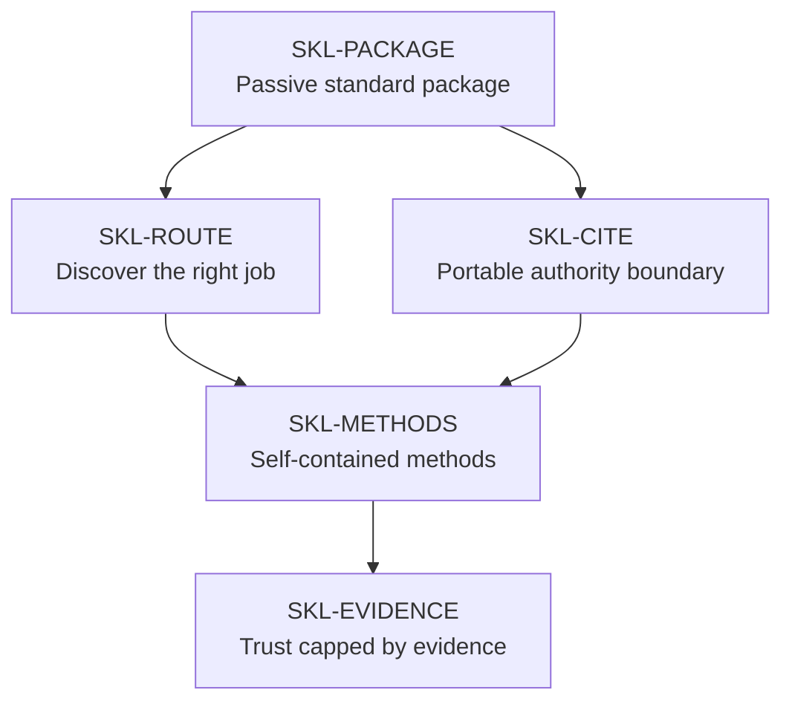

# Skills capability DAG

This file is the product capability graph. Destination stays in
[vision.md](vision.md). Current work stays on its product change surface.

The repository ships reusable Agent Skill packages. It does not ship company
policy, project-specific coordination state, a runtime, an installer, or a
control plane. A generic skill may still produce a bounded planning,
coordination, handoff, or review artifact requested by its user.

## Graph

## Capabilities

| ID | Capability | Depends on | Done when |
| --- | --- | --- | --- |
| `SKL-PACKAGE` | Passive standard package | — | Every installable entry is `skills/<name>/SKILL.md`; its frontmatter name matches its folder; optional references, scripts, and assets support that one package. No package injects global instructions, runs a daemon, installs itself, or starts a persistent coordinator merely by being installed. |
| `SKL-ROUTE` | Discover the right job | `SKL-PACKAGE` | The concise `name` and `description` select one recurring, independently useful job and distinguish its nearest neighbours under host-native discovery. No catalog-owned router or keyword engine is required. |
| `SKL-CITE` | Portable authority boundary | `SKL-PACKAGE` | A generic package is organization-neutral and self-contained. It cites current public or supplied authority when the job depends on external facts. Company policy, private topology, volatile live state, and project-only procedures stay with their owners. |
| `SKL-METHODS` | Self-contained reusable methods | `SKL-ROUTE`, `SKL-CITE` | A user can request the job and perform the method without hidden organizational context. Useful decision rules, failure modes, recovery, boundaries, and acceptance output are preserved. A method may create a bounded coordination artifact, but it does not become authority for project state or a runtime control plane. Generic wrappers with no knowledge delta are not published. |
| `SKL-EVIDENCE` | Trust capped by evidence | `SKL-METHODS` | Package format, local links, and bundled scripts pass repository checks; material method or routing changes are exercised on representative requests when the relevant host is available. Structural green is never presented as proof of behavior or adoption. |

## Edge test

An edge exists only when the child cannot be correct before the parent:

- routing requires a valid package contract;
- a reusable method requires both a discoverable job and a portable authority
  boundary; and
- behavioral evidence can evaluate only a concrete method.

Roadmap order, package count, review state, and installation state are not
capability edges.

## Falsification

This graph is wrong if any of the following is true:

- a generic skill requires hidden organization-only policy, role, topology, or
  state to execute;
- two packages own the same request, artifact, and acceptance boundary;
- a package hides unique useful method behind an unselectable description;
- a global prompt, constitution injector, scheduler, installer, or catalog
  daemon is shipped as Skill behavior; or
- a format check is claimed as proof that a method works in practice.

Fix the owning package or this graph. Do not add a parallel catalog or status
document.
