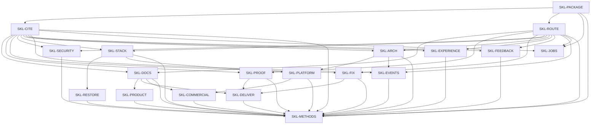

# Skills capability DAG

This file is the product capability graph. Destination stays in
[vision.md](vision.md). Problem, users, and scope stay in `docs/prd.md`
when that document is a real PRD. Current work stays on the product PR.

Skills owns **installable agent methods derived from** `SylphxAI/owner`
`standards/` and `decisions/`. It does not own company law, host
discovery, or live product behavior.

| This file | Not this file |
| --- | --- |
| Durable method-family IDs, real edges, falsifiable oracles | A copy of the PRD one-row table |
| What must exist before a downstream method can be correct | Package inventory, review-pack listing, or score |
| Owner-citable leaves | Execution state, claims, or CI color |

`SKL-METHODS` is the standing outcome Owner already cites. Rows below
decompose it. A package name in the notes is a present semantic owner,
not a second graph.

## Graph

Every method family depends on `SKL-PACKAGE`, `SKL-CITE`, and
`SKL-ROUTE`. Extra edges are hard prerequisites: the child cannot be
correct before the parent contract is true.

The table below is authority. This Mermaid `flowchart` names the same
IDs (Owner `standards/docs.md` Diagrams). Repair the picture if it
omits or invents an edge.

## Capabilities

| ID | Capability | Depends on | Done when |
| --- | --- | --- | --- |
| SKL-PACKAGE | Passive Agent Skills packages, host-native install | — | Every published package is `skills/<name>/SKILL.md` whose frontmatter `name` matches the folder and validates against the [Agent Skills specification](https://agentskills.io/specification). `SKILL.md` is the only package contract. No package or script injects constitutions, runs a catalog daemon, or owns host install, cache, or update. README install is host plugin commands only. **Fails if:** `skills-ref validate` is red; a second job manifest (`capability.json`, `project.manifest.json`) is the contract; a managed-constitution injector or auto-sync daemon exists; this repo ships an installer or scheduler. |
| SKL-CITE | Cite Owner law; no competing original | SKL-PACKAGE | Any package that states a company default names `SylphxAI/owner` `standards/` or `decisions/` as the authority. No package publishes a second principles, stack, labor, or Owner-tick original. Owner-only reconstruct / cut / dispatch / challenge jobs stay in `SylphxAI/owner` `.agents/skills/`. **Fails if:** a public skill implements Owner reconstruction or Worker spawn; `docs/policies/PRINCIPLES.md` is an original; a language, docs-home, CI-runner, or labor default contradicts Owner without a citation. |
| SKL-ROUTE | Discover one semantic owner | SKL-PACKAGE | Concise `name` and `description` select the intended package for a realistic request of each method family and reject the nearest neighbour. One independently accepted job has one package. **Fails if:** two packages share one job, outcome, and acceptance boundary; Owner-tick language is a public trigger; a company-standard job in this graph has no requestable description. |
| SKL-DOCS | Locked documentation homes | SKL-CITE, SKL-ROUTE | A request to write destination, capability DAG, PRD, ADR, or README loads one method that places each fact in Owner `standards/docs.md` homes: destination `docs/vision.md`, capability DAG this file, current work on the product PR, ADR `docs/adr/`. New destination files are only `docs/vision.md`. Vision, NSM, Goal, and PRD stay distinct. **Fails if:** the method creates a new `docs/NORTH-STAR.md` destination; treats `docs/prd.md` as the capability DAG after this file exists; invents an NSM so the repo “has a North Star”; adds file-existence CI for headings. |
| SKL-PROOF | Artifact / check / live; commit-build | SKL-CITE, SKL-ROUTE | A request to build or simplify CI loads a method whose required checks fail only on a real product, build, security, or public-contract defect. Artifact, check, and live stay distinct. This repository’s required workflow does not red on slogan, heading, or file-existence. **Fails if:** a required check is heading or slogan regex; a house score is taught as North Star; a green check is sold as live or as proof the method improved outcomes. |
| SKL-FIX | Correct fix vs hack vs workaround | SKL-CITE, SKL-ROUTE | A request to choose a path or replace a predecessor classifies **correct fix / violation / hack / workaround** per Owner `standards/exceptions.md` and [ADR-010](https://github.com/SylphxAI/owner/blob/main/decisions/ADR-010-NO-PERMANENT-BYPASS.md). Hard cutover leaves one authority and deletes the predecessor in the same delivery. A workaround names owner, replacement, sunset, and deletion terminal. **Fails if:** “patch” is treated as a legal status; a dual path remains after the cutover; an expired workaround is taught as the method. |
| SKL-SECURITY | Threat model and data classes | SKL-CITE, SKL-ROUTE | Changing a trust boundary, privileged action, data class, integration, or public exposure produces a threat-model contract before or with implementation. Unknown data class fails closed. Customer Identity and operator IAM stay different issuers. **Fails if:** “add auth later” is accepted on a public write; secrets or personal data are taught into source, analytics, or tickets; a health endpoint is sold as a security proof. |
| SKL-STACK | Company stack and live version pins | SKL-CITE, SKL-ROUTE | Version selection queries current upstream and applies Owner `standards/stack.md` roles: Rust on backend and critical path; TypeScript + Bun + Next.js on web only; Atlas the sole schema applicator; Connect + Protobuf Editions; Platform Journal for deploy; Hands for Kubernetes writes; `sylphx-linux-standard` for product CI. **Fails if:** the method teaches `ubuntu-latest`, product `kubectl`, TypeScript-as-backend, ORM push to live, or `minScale ≥ 1` as “serverless” as the company default; or copies stale version pins into Owner law. |
| SKL-ARCH | One architecture shape | SKL-CITE, SKL-ROUTE | An architecture decision applies Owner `standards/architecture.md` as one shape: capability-first modular DDD, ports and adapters, functional core / imperative shell. Domain imports no framework I/O. Events and polling are one reconcile loop. Folder names are not completion. **Fails if:** Hexagonal or DDD folders are mandatory house architecture; Event Sourcing or a workflow engine is required without its predicate; a TypeScript backend fallback is an architecture option. |
| SKL-PLATFORM | Bind Identity / Data / Work / Events / Commerce / AI | SKL-STACK, SKL-ARCH | Binding a shared substrate capability uses Owner `standards/platform.md`: declare intent, run `type=web`, keep durable memory out of process RAM, wake Work over HTTP, prove with write-then-read on the public contract. Product does not own deploy, kube, a second IdP, mailer, ledger, or model gateway. **Fails if:** a product deploy controller or `minScale ≥ 1` is taught as serverless; operator `svc_` is a customer session; health 200 is proof of data, auth, money, or delivery. |
| SKL-RESTORE | Restore class and oracle | SKL-STACK | Every authoritative store names class C0–C6, write authority, restore oracle, and product RPO/RTO. Revert is PITR, snapshot, forward repair, or previous healthy deploy. **Fails if:** a backup without a restore drill is accepted as done; `migrate down` is ordinary recovery; workspace-class volumes are taught onto Velero CSI as the default. |
| SKL-EVENTS | Domain / integration / delivery / analytics kinds | SKL-CITE, SKL-ROUTE, SKL-ARCH | Domain, integration, delivery, and analytics events stay distinct per Owner `standards/events.md`. CloudEvents is the cross-boundary envelope, not the domain model. Notifications have a type, one `dedupe_key`, and consent that is not inferred across channels. Analytics start from a named decision; client purchase events are not entitlement. **Fails if:** telemetry types are imported into domain policy; a path-shaped event ID is identity; a second company event bus or house event KPI is taught. |
| SKL-FEEDBACK | Sound buses, juice, haptics | SKL-CITE, SKL-ROUTE | Sound uses Keel buses `MASTER` / `MUSIC` / `SFX` / `UI`. Families are mix sends, not a fifth company bus. Juice is presentation and does not write simulation or economy. Haptics never carry unique meaning. **Fails if:** a title-local `SoundType` bypasses Keel buses; audio is the only cue for required state; juice writes gameplay or ledger state. |
| SKL-EXPERIENCE | Interface states, access, locale, Telegram | SKL-CITE, SKL-ROUTE | Every reachable surface names the states it can enter. Essential information uses redundant channels. Internationalization is in the first contract. Telegram is the sole company bot surface: sparse slash, keyboard plus edit trees, rich Message only. **Fails if:** colour, sound, haptic, or hover is the only affordance; a second Telegram formatter is kept; machine translation is accepted for purchase, consent, legal, or safety text. |
| SKL-COMMERCIAL | Price, entitlement, ledger homes | SKL-DOCS, SKL-PLATFORM | Why we priced lives in a product commercial ADR. Live price lives in the billing SSOT. Entitlement lives in owning code, schema, and tests. Grant follows a ledger event; refunds append. Destination is not a price. **Fails if:** chat is the pricing SSOT; a client event is payment success; a historical price is mutated in place; telemetry is taught as the ledger. |
| SKL-PRODUCT | Destination and typed completion | SKL-DOCS | Design, build, finish, and review methods evaluate against `docs/vision.md` and this graph. Completion is a typed claim (implementation candidate, source, remaster 1:1, preview, live). “Capability exists” is not a finished product. **Fails if:** remaster 1:1 is replaced by a score; unit tests are sold as remaster parity; destination is shrunk to match current source. |
| SKL-DELIVER | Implement-to-PR without Owner labor | SKL-DOCS, SKL-PROOF, SKL-FIX | A delivery request binds one write-set and drives it to a pull request. Local, candidate, landed, released, and live stay distinct. The method does not poll CI, spawn Workers, reconstruct Owner `DASHBOARD.md`, or treat PR submission as live. Incidents are product-DAG work in the owning repository. **Fails if:** a public skill encodes Owner reconstruct, cut, or dispatch; merge or live is claimed from implement-to-PR; DASHBOARD or chat is the backlog. |
| SKL-JOBS | Independently requested domain jobs | SKL-PACKAGE, SKL-ROUTE, SKL-CITE | Review, research, craft, and support jobs that are **not** company law keep one semantic owner each and do not publish principles, stack, or labor originals. **Fails if:** a domain pack becomes a second company standard; two packs own one independently accepted job. Not required for `SKL-METHODS`. |
| SKL-METHODS | Installable methods from Owner standards | SKL-PACKAGE, SKL-ROUTE, SKL-CITE, SKL-DOCS, SKL-PROOF, SKL-FIX, SKL-SECURITY, SKL-STACK, SKL-ARCH, SKL-PLATFORM, SKL-RESTORE, SKL-EVENTS, SKL-FEEDBACK, SKL-EXPERIENCE, SKL-COMMERCIAL, SKL-PRODUCT, SKL-DELIVER | A real request can discover, load, and perform each company-standard job from `skills/<name>/SKILL.md`. Every parent oracle is true. Trust is capped by current evidence, not by a green structural check. **Fails if:** any parent oracle is false; a second company principle, stack, or labor original is live in this catalog. |

## Edges

An edge exists only when the child cannot be correct before the parent.

| Edge | Why it is required |
| --- | --- |
| PACKAGE → CITE, ROUTE | Citation and discovery live in package metadata and body. |
| CITE + ROUTE → each method family | An undiscoverable or competing-law method is not an installable company method. |
| STACK → PLATFORM, RESTORE | Bind and restore use Atlas, runner, and language roles from stack law. |
| ARCH → PLATFORM, EVENTS | Planes and event kinds collapse if architecture facets are optional religions. |
| DOCS → PRODUCT, COMMERCIAL, DELIVER | Destination, DAG, ADR, and PR homes are documentation law. |
| PLATFORM → COMMERCIAL | Grant-after-ledger is a substrate bind, not a pricing essay. |
| DOCS + PROOF + FIX → DELIVER | Delivery that writes the wrong home, sells check as live, or keeps a dual path is the wrong method. |

Roadmap order, package-count targets, and write-set collisions are not
edges. Individual packages under one ID may proceed in parallel when
their write sets do not collide.

## Present packages

These names are today’s semantic owners. They are not additional IDs.

| ID | Present owner |
| --- | --- |
| SKL-PACKAGE | `author-skill`; repository layout; host README |
| SKL-CITE | `drive-to-delivery` documentation-standard (thin) |
| SKL-ROUTE | package frontmatter; `curate-skill-repository` |
| SKL-DOCS | `drive-to-delivery` documentation-standard |
| SKL-PROOF | `implement-continuous-integration`; `design-skill-evals` |
| SKL-FIX | `establish-correct-approach`; `execute-hard-cutover`; `maintain-product` |
| SKL-SECURITY | `model-security-threats`; `design-privacy-lifecycle` |
| SKL-STACK | `select-dependency-versions` |
| SKL-ARCH | `decide-architecture-shape` |
| SKL-PLATFORM | `wire-managed-backend-services`; `persist-app-data`; `run-background-work`; `authenticate-app-users`; `deliver-app-events` |
| SKL-RESTORE | `review-product-recovery-contract` |
| SKL-EVENTS | `review-product-analytics-instrumentation`; `review-notification-strategy`; `deliver-app-events` |
| SKL-FEEDBACK | `design-game-product` (no dedicated bus/juice owner yet) |
| SKL-EXPERIENCE | `craft-product-interface`; `craft-telegram-bot-surface`; `review-accessibility-conformance-program` |
| SKL-COMMERCIAL | `price-saas-subscription`; `build-payment-readiness` |
| SKL-PRODUCT | `design-product`; `build-product`; `finish-product`; `review-launch-readiness` |
| SKL-DELIVER | `drive-to-delivery`; `select-next-work`; `bound-request-scope`; `run-incident-response` |
| SKL-JOBS | independently requested `review-*`, research, and operate packages |

## How to falsify this file

This graph is wrong if any of the following can be shown:

- a legal company-standard method that cannot be named by any ID
  in this graph;
- a done-when that can be greened by a heading, package count, or
  `skills-ref` pass alone;
- an edge that is only roadmap preference;
- a public skill that is the Owner reconstruct / cut / dispatch loop;
- `docs/prd.md` remaining the capability DAG after this file exists.

Fix this file. Do not add a balancing document.
