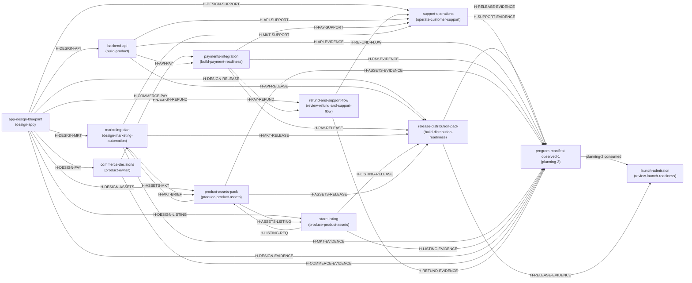

# Product Program Manifest — Mobile App Delivery Program

**program_id:** `prg-mobile-app-2026.08`
**product_id:** `product-mobile-app` (working name; exact product name is a design fact)
**manifest phase:** `planning`
**manifest revision:** `planning-1` — immutable once consumed
**authored:** 2026-08-11
**owner skill:** `compose-product-program`

This planning revision composes seven independently owned delivery domains — design, backend API, payments, assets, release, marketing, support — into one acyclic program with one accountable owner per artifact, typed handoffs, executable gates, and evidence-backed Definition of Done per part. It does not rewrite design, commerce, campaign, media, store, or implementation facts; it owns the graph.

---

## 1. Artifact envelope and program truth

### 1.1 Envelope

| Field | Value |
| --- | --- |
| schemaVersion | 2 |
| artifactId | `program-manifest` |
| productId | `product-mobile-app` |
| artifactKind | `product-program-manifest` |
| ownerSkill | `compose-product-program` |
| artifactVersion | `0.1.0` |
| artifactRevision | `planning-1` |
| artifactState | `draft` |
| inputArtifacts | none — no upstream artifact exists yet; requested inputs in §1.5 are requests, not consumed references |
| supersedes | none |

No digests appear anywhere in this draft. When `planning-1` is accepted, it is sealed; downstream references then record its exact bytes and digest. It never self-hashes and never back-references a consumer.

### 1.2 Objective

Deliver the mobile app to generally available (GA) on iOS and Android by driving seven domains to a declared target through small verified slices: `app-design-blueprint`, `backend-api`, `payments-integration` (plus `commerce-decisions` and `refund-and-support-flow` as required canonical owners), `product-assets-pack`, `store-listing`, `release-distribution-pack`, `marketing-plan`, and `support-operations`. Every artifact has exactly one owner, every handoff has a stable producer-owned ID and acceptance tests, every gate is executable, and completion is proven by accepted evidence — never by a document or a store upload alone.

### 1.3 Constraints

- Native iOS and Android are the declared platforms for this revision (assumption A-1; PWA decision in D-2).
- Facts have one canonical home; downstream artifacts reference, never copy, canonical facts.
- `planning-1` is immutable once any downstream artifact consumes it. The observed-state revision (`planning-2`) supersedes it and indexes exact accepted sibling evidence; no artifact that consumed `planning-1` may be back-referenced by it.
- External authority (store accounts, PSP underwriting, legal, certification, platform review) is a real gate. Automation prepares, submits, polls, reconciles, and recovers inside authority; it never fabricates approval.
- Raw signing keys stay in a secrets broker/HSM/protected CI identity — never in agent context.
- P0/P1/P2 deferral is not used. Each capability has explicit construction, proof, and exposure/release states; an unselected option is `retired` or `contract-ready`, never “later”.
- Draft artifacts carry no digest; sealed inputs require `sha256-exact-bytes` digests recorded by the consumer/index.

### 1.4 Ruin boundaries — the program is failed if

- the released artifact differs from the tested/attested artifact (rebuild-after-test).
- payments go live without idempotent ledger, settlement reconciliation, and refund/entitlement consequence flow.
- marketing, store listing, or support claims disagree with the design promise or live behavior.
- a refund or account consequence destroys data the design promised for export/delete, or leaves the ledger unreconciled.
- store release proceeds without account/certification authority and live readback evidence.
- any artifact lacks an owner, a handoff ID, an acceptance test, or a target state; any dependency cycle exists; any revision both consumes and indexes the same artifact.
- a rollback would erase committed purchases, grants, user work, or cross-device state.

### 1.5 Fact labels

| ID | Fact | Label |
| --- | --- | --- |
| F-1 | A new mobile app is being delivered; domains: design, backend API, payments, assets, release, marketing, support | `given` |
| F-2 | Deliverable is `program-manifest.md` in this workspace | `given` |
| F-3 | Mobile product ships on iOS and Android (native) | `assumed` (A-1) |
| F-4 | Product has a commercial model requiring payments (monetization semantics unconfirmed) | `assumed` (A-2) |
| F-5 | Launch window, territories, locale list, product name/category, age rating unknown | `requested` (R-1…R-5) |
| F-6 | Owner assignments, handoff scheme, gate order in this manifest | `decision` (D-1…D-8) |
| F-7 | No design blueprint exists yet; no design fact is invented here | `observed` |

### 1.6 Assumptions (status: unverified until evidenced)

| ID | Statement | Status |
| --- | --- | --- |
| A-1 | Native iOS + Android binaries; single app codebase with platform ports | unverified |
| A-2 | B2C in-app commerce with provider-processed payments; refunds may apply | unverified |
| A-3 | English-first with additional locales to be decided (R-4) | unverified |
| A-4 | Support is staffed across the same territories as release | unverified |
| A-5 | App has network backend (accounts, sync, commerce) | unverified |
| A-6 | Store accounts, PSP account, and signing identities exist or can be provisioned before G-RELEASE | unverified |

### 1.7 Requested upstream artifacts (typed requests — not consumed, not prose gaps)

| Request | Needed from | Contract required | Unlocks |
| --- | --- | --- | --- |
| R-1 | `app-design-blueprint` from `design-app` | Product promise, user flows, object/loop semantics, monetization model, brand tokens, ruin boundaries, platform/age/territory scope | All `H-DESIGN-*` handoffs |
| R-2 | `commerce-decisions` from `product-owner` | PSP selection, price points, fee/refund posture, tax setup, billing SSOT | `H-COMMERCE-PAY` |
| R-3 | Release targets from exec sponsor + `design-app` | Launch window, territories, rollout intent | `H-DESIGN-RELEASE`, `H-MKT-RELEASE` |
| R-4 | Locale list + fallback graph decision | BCP 47 locale set, script/region fallback, store + support coverage | Asset, listing, support plans |
| R-5 | Age rating / audience mode | Store questionnaire answers, child-safety posture | Release and store gates |
| R-6 | Product name and category | Trademark check, store category, campaign claims | Listing, marketing, release |

---

## 2. Artifact and owner registry

### 2.1 Canonical fact owners

| Canonical fact | Owned by artifact |
| --- | --- |
| Product promise, UX, capability semantics, monetization model semantics, localization semantics, brand tokens | `app-design-blueprint` |
| Pricing/packaging decisions, PSP selection, billing SSOT | `commerce-decisions` |
| API contract, schema, identity/data authority, SLO, migration plan | `backend-api` |
| Provider transaction, ledger, settlement, entitlement integration | `payments-integration` |
| Refund customer/account consequence and appeal | `refund-and-support-flow` |
| Finished product media, exact files, digests, rights/provenance, LQA | `product-assets-pack` |
| Store listing narrative, asset selection/order, channel metadata | `store-listing` |
| Marketing channel/budget/creative control plane, campaign briefs, claims, audience/consent, measurement | `marketing-plan` |
| Store submission/certification/release evidence, rollout, live readback | `release-distribution-pack` |
| Support SLAs, playbooks, feedback/close-loop, complaint handling | `support-operations` |
| Program graph, handoffs, gates, SDK registry, DoD | `program-manifest` |
| Independent launch verdict | `launch-admission` |

### 2.2 Artifact registry — identity, facts, inputs, outputs

One owner per artifact. “Owner” = owning skill/system + accountable role (role is a staffing decision, not a person).

| Artifact ID | Kind | Owner skill / accountable role | Version / revision / state | Canonical facts | Inputs (handoffs) | Outputs (handoffs) |
| --- | --- | --- | --- | --- | --- | --- |
| `app-design-blueprint` | app-design-blueprint | `design-app` / Design Lead | 0.1.0 / requested / draft | Promise, flows, monetization semantics, brand, scope, ruin boundaries | none | `H-DESIGN-API`, `H-DESIGN-PAY`, `H-DESIGN-MKT`, `H-DESIGN-ASSETS`, `H-DESIGN-LISTING`, `H-DESIGN-RELEASE`, `H-DESIGN-SUPPORT`, `H-DESIGN-REFUND`, `H-DESIGN-EVIDENCE` |
| `commerce-decisions` | commerce-decisions | `product-owner` / Commercial Decision Owner | 0.1.0 / requested / draft | PSP, price points, fee/refund posture, tax, billing SSOT | `H-DESIGN-PAY` | `H-COMMERCE-PAY`, `H-COMMERCE-EVIDENCE` |
| `backend-api` | backend-api | `build-product` / Backend Lead | 0.1.0 / requested / draft | API contract, schema, identity/data, SLO, migration, observability | `H-DESIGN-API` | `H-API-PAY`, `H-API-RELEASE`, `H-API-SUPPORT`, `H-API-EVIDENCE` |
| `payments-integration` | payments-integration | `build-payment-readiness` / Payments Lead | 0.1.0 / requested / draft | Provider ledger, settlement, entitlement, tax/fraud, compliance evidence | `H-COMMERCE-PAY`, `H-API-PAY` | `H-PAY-RELEASE`, `H-PAY-SUPPORT`, `H-PAY-REFUND`, `H-PAY-EVIDENCE` |
| `refund-and-support-flow` | refund-and-support-flow | `review-refund-and-support-flow` / Refund Policy Owner | 0.1.0 / requested / draft | Refund policy, account consequences, appeal path | `H-DESIGN-REFUND`, `H-PAY-REFUND` | `H-REFUND-FLOW`, `H-REFUND-EVIDENCE` |
| `store-listing` | store-listing | `produce-product-assets` / Store Listing PM | 0.1.0 / requested / draft | Listing narrative, asset selection/order, channel metadata, localized copy | `H-DESIGN-LISTING`, `H-ASSETS-LISTING` | `H-LISTING-REQ`, `H-LISTING-RELEASE`, `H-LISTING-EVIDENCE` |
| `product-assets-pack` | product-assets-pack | `produce-product-assets` / Asset Producer | 0.1.0 / requested / draft | Exact rendered media, digests, rights/provenance, LQA, accessibility | `H-DESIGN-ASSETS`, `H-MKT-BRIEF`, `H-LISTING-REQ` | `H-ASSETS-LISTING`, `H-ASSETS-MKT`, `H-ASSETS-RELEASE`, `H-ASSETS-EVIDENCE` |
| `marketing-plan` | marketing-plan | `design-marketing-automation` / Marketing Lead | 0.1.0 / requested / draft | Channel/budget/creative plan, claims, audience/consent, measurement | `H-DESIGN-MKT`, `H-ASSETS-MKT` | `H-MKT-BRIEF`, `H-MKT-RELEASE`, `H-MKT-SUPPORT`, `H-MKT-EVIDENCE` |
| `release-distribution-pack` | distribution-evidence-pack | `build-distribution-readiness` / Release Lead | 0.1.0 / requested / draft | Channel adapters, signing/attestation, submission states, rollout, live readback | `H-DESIGN-RELEASE`, `H-API-RELEASE`, `H-PAY-RELEASE`, `H-MKT-RELEASE`, `H-LISTING-RELEASE`, `H-ASSETS-RELEASE` | `H-RELEASE-EVIDENCE` |
| `support-operations` | support-operations | `operate-customer-support` / Support Lead | 0.1.0 / requested / draft | SLAs, playbooks, feedback close-loop, complaints, escalation | `H-DESIGN-SUPPORT`, `H-API-SUPPORT`, `H-PAY-SUPPORT`, `H-MKT-SUPPORT`, `H-REFUND-FLOW` | `H-SUPPORT-EVIDENCE` |
| `program-manifest` | product-program-manifest | `compose-product-program` / Program Owner | 0.1.0 / `planning-1` / draft | Program graph, gates, DoD, SDK registry | none | `planning-1` (consumed by all domains) |
| `launch-admission` | launch-admission | `review-launch-readiness` / Independent Launch Reviewer | 0.1.0 / requested / draft | Independent launch verdict | `planning-2` (observed-state manifest), `H-RELEASE-EVIDENCE` | Launch admission decision |

### 2.3 Definition of Done per artifact

“Done” for a part means the artifact is at its declared target with accepted evidence at the state shown — not authored, not merged, not uploaded.

| Artifact | Done = (evidence required) |
| --- | --- |
| `app-design-blueprint` | Sealed blueprint at `design-validated`; usability/design studies recorded; flows, monetization semantics, brand tokens, ruin boundaries, platform/age/territory scope accepted; all `H-DESIGN-*` contracts issued with fixtures |
| `commerce-decisions` | PSP selected and underwriting accepted; price points, fee/refund posture, tax setup recorded in billing SSOT; `H-COMMERCE-PAY` contract fixtures issued |
| `backend-api` | `implementation-verified` + `scale-verified`: contract tests green against `H-DESIGN-API`; load/soak envelope evidence; schema migration rehearsed; SLO dashboards live; kill switches exercised; `H-API-*` handoffs issued with compatibility fixtures |
| `payments-integration` | `implementation-verified` + `scale-verified` in staging: sandbox checkout, idempotent ledger, settlement reconciliation run, refund/entitlement tests pass; fraud and provider-outage drills pass; production provider access granted; compliance evidence in `H-PAY-RELEASE` |
| `refund-and-support-flow` | Refund policy and appeal path accepted; account/data consequences tested against design export/delete promises; ledger reconciliation after refund verified; `H-REFUND-FLOW` fixtures issued |
| `store-listing` | Localized narrative + asset selection accepted per channel; claims match blueprint; metadata contract fixtures issued via `H-LISTING-RELEASE` |
| `product-assets-pack` | Sealed pack: deterministic capture, finished screenshots/key art/trailer per channel + locale, LQA + accessibility passed, rights/provenance documented, exact-file digests recorded by consumers; `H-ASSETS-*` handoffs issued |
| `marketing-plan` | Marketing blueprint + creative briefs accepted; claims traced to blueprint; audience/consent/opt-out ready; measurement dashboard live; `H-MKT-BRIEF`/`H-MKT-RELEASE`/`H-MKT-SUPPORT` issued |
| `release-distribution-pack` | Distribution Evidence Pack accepted: exact artifact digest + signing/attestation, store submission states, rollout health gates passed, live readback verified per channel; `H-RELEASE-EVIDENCE` issued |
| `support-operations` | Channels and tooling live; SLAs, playbooks, escalation, refund flow rehearsed; feedback close-loop operating; complaint handling tested; `H-SUPPORT-EVIDENCE` issued |
| `program-manifest` | Planning revision sealed and consumed; later observed-state revision supersedes it and indexes exact accepted evidence; graph stays acyclic |
| `launch-admission` | Independent reviewer evaluates evidence and issues admission/denial with cited evidence; no self-certification |

---

## 3. Lifecycle capability matrix

State axes: construction (`build-to-scale-now` / `queued-by-exact-dependency` / `floor-blocked` / `retired`), proof (`hypothesis` → `design-validated` → `implementation-verified` → `scale-verified` → `production-proven`), exposure (`unavailable` / `authority-gated` / `canary` / `staged` / `generally-available` / `degraded` / `withdrawn`).

| Artifact | Construction | Proof (current → target) | Exposure target | Scale / failure envelope (declared by owner, evidenced before promote) | Migration / recovery | Maintenance loop (§9) |
| --- | --- | --- | --- | --- | --- | --- |
| `app-design-blueprint` | queued-by-exact-dependency (R-1) | hypothesis → design-validated | unavailable (inputs to others) | N/A — semantics only | Blueprint supersession = new revision, re-issued handoffs | L-DESIGN |
| `commerce-decisions` | queued-by-exact-dependency (R-2, H-DESIGN-PAY) | hypothesis → design-validated | unavailable | N/A | Price/PSP change = new decision revision, re-issued H-COMMERCE-PAY | L-COMMERCE |
| `backend-api` | build-to-scale-now (after H-DESIGN-API) | hypothesis → scale-verified | canary → staged → generally-available | SLO + peak RPS envelope with load evidence; autoscale; per-tenant failure isolation; circuit breakers | Schema migration rehearsed; N-1/N/N+1 compatibility; forward-fix; kill switches | L-API |
| `payments-integration` | queued-by-exact-dependency (H-COMMERCE-PAY, H-API-PAY) | hypothesis → scale-verified | canary → generally-available | Daily settlement reconciliation; idempotency + dedupe; provider-outage circuit breaker; fraud alert SLA | Refund reversal with ledger reconciliation; provider replacement test | L-PAY |
| `refund-and-support-flow` | queued-by-exact-dependency (H-DESIGN-REFUND, H-PAY-REFUND) | hypothesis → implementation-verified | generally-available with support | Complaint/regulator window handling; appeal backlog ceiling | Policy change = new revision; account consequence replay | L-SUPPORT |
| `store-listing` | queued-by-exact-dependency (H-DESIGN-LISTING) | hypothesis → implementation-verified | authority-gated → generally-available | Per-channel metadata limits; locale parity | Metadata revision per channel; supersession on asset change | L-ASSETS |
| `product-assets-pack` | queued-by-exact-dependency (briefs) | hypothesis → implementation-verified | unavailable (feeds others) | Deterministic capture; exact-file QA; digest verification | New brief = new pack revision; rights renewal loop | L-ASSETS |
| `marketing-plan` | queued-by-exact-dependency (H-DESIGN-MKT) | hypothesis → implementation-verified | canary → staged → generally-available | Spend/impression budget; conversion measurement; claim drift detection | Campaign halt/withdraw; creative refresh | L-MKT |
| `release-distribution-pack` | queued-by-exact-dependency (6 inputs) | hypothesis → production-proven | authority-gated → canary → staged → generally-available | Rollout health gates (crash, error, startup, purchase/restore, support spike); auto-halt; forward superseding build | Halt/withdraw; no rollback that erases ledger facts; N-1 compatibility | L-RELEASE |
| `support-operations` | queued-by-exact-dependency (design/API/pay/mkt/refund) | hypothesis → production-proven | staged → generally-available | First-response SLA; queue ceiling; escalation path; store/regulator complaint windows | Playbook supersession; incident recovery handoff | L-SUPPORT |
| `program-manifest` | build-to-scale-now (this revision) | design-validated (planning) | unavailable | N/A | planning-2 supersedes planning-1 | L-PROGRAM |
| `launch-admission` | queued-by-exact-dependency (planning-2 + evidence) | design-validated → implementation-verified | unavailable (decision only) | N/A | Denial → typed blocker, re-review after fix | L-PROGRAM |

---

## 4. Dependency DAG, critical path, delivery order, handoffs

### 4.1 Dependency graph



Acyclic by construction: no edge returns to an ancestor; `planning-2` is produced only after all consumers of `planning-1` have delivered, and `launch-admission` consumes `planning-2` + evidence without feeding anything back.

### 4.2 Critical path

`app-design-blueprint` → `backend-api` → `payments-integration` → `release-distribution-pack` → `program-manifest planning-2` → `launch-admission`.

Parallel rails that join at release: `marketing-plan` + `store-listing` → `product-assets-pack` (briefs → media → listing/campaign); `refund-and-support-flow` → `support-operations`. Support must be `production-proven` before GA, joining the same release gate.

### 4.3 Delivery order and slices

| Phase | Work | Slices (each verified, each accepted before the next) |
| --- | --- | --- |
| P0 | Design foundation | Blueprint: promise → flows → monetization → brand/scope → seal |
| P1 | API + commercial (parallel after P0) | `backend-api`: auth/identity → core domain flows → commerce/entitlement hooks → SLO/migration/observability. `commerce-decisions`: PSP selection → price/fee/tax decisions |
| P2 | Payments + refund | Sandbox checkout → ledger + entitlement → refunds/tax/fraud → scale + production access. `refund-and-support-flow`: policy → account consequences → appeal path |
| P3 | Marketing + listing + assets (parallel after P0) | `marketing-plan`: audience/claims/consent → briefs. `store-listing`: narrative → asset request. `product-assets-pack`: source capture → key art/screenshots/trailer per locale → LQA/rights/seal |
| P4 | Release build-up | Internal track (TestFlight/Play internal) → closed beta → staged rollout (canary → bounded % steps) → GA |
| P5 | Support + program close | Channels/tooling → playbooks/refund flow → live ops + feedback loop. `program-manifest planning-2` + `launch-admission` |

### 4.4 Collision boundaries (cross-domain consistency tests)

- Design promise vs marketing claims vs store listing vs support copy — one truth, one owner (`app-design-blueprint`), all others reference.
- Price/catalog: UI, provider, entitlement, campaign, and support must agree with `commerce-decisions` billing SSOT.
- Refund consequences must not violate design export/delete promises; ledger must reconcile after every refund.
- Locale, age, privacy, and commerce capability must be identical across channel claims and live behavior.
- Release artifact identity: tested artifact = attested artifact = submitted artifact = live artifact.
- Campaign and store deep links must target live, authorized, non-refunded, region-available states.
- Rollback/halt must never erase committed purchases, grants, or user data; recovery is forward-fix.
- No manifest revision may both consume and index the same artifact; no handoff may lack a producer-owned ID.

### 4.5 Handoff register

Every handoff is producer-owned, stable, and has acceptance tests with fixtures (schema, test suite, or checklist) supplied by the producer. A consumer verifies `artifactId`, version/revision/state, and `fulfillsHandoffId`, then records the consumed revision in its own envelope.

**Work handoffs**

| Handoff ID | Producer → consumer | Contract (carries) | Acceptance tests |
| --- | --- | --- | --- |
| `H-DESIGN-API` | `app-design-blueprint` → `backend-api` | Capability semantics, flows, data model, identity, offline/error semantics, scale intent | `AT-DA-1` every design flow maps 1:1 to endpoint + state; `AT-DA-2` no flow is left unowned in the API contract fixture; `AT-DA-3` identity/offline semantics match blueprint ruin boundaries |
| `H-DESIGN-PAY` | `app-design-blueprint` → `commerce-decisions` | Monetization model and value-exchange semantics | `AT-DP-1` price points derived from declared value exchange; `AT-DP-2` entitlement semantics defined |
| `H-COMMERCE-PAY` | `commerce-decisions` → `payments-integration` | PSP, price points, fee/refund posture, tax setup, billing SSOT | `AT-CP-1` ledger records match billing SSOT; `AT-CP-2` provider terms + underwriting attached; `AT-CP-3` tax territories match release scope |
| `H-API-PAY` | `backend-api` → `payments-integration` | Commerce schema, idempotency keys, entitlement hooks, webhook contract | `AT-AP-1` contract tests pass for checkout/entitlement/refund paths; `AT-AP-2` idempotent replay produces no duplicate charge; `AT-AP-3` webhook events are ordered and replayable |
| `H-DESIGN-MKT` | `app-design-blueprint` → `marketing-plan` | Promise, claims vocabulary, audience, brand tokens, monetization framing | `AT-DM-1` every campaign claim traces to a blueprint fact; `AT-DM-2` audience/consent plan matches age/territory scope |
| `H-DESIGN-ASSETS` | `app-design-blueprint` → `product-assets-pack` | Brand tokens, tone, capture source truth, required media set | `AT-DA2-1` media list covers all blueprint surfaces; `AT-DA2-2` captures derive from approved source truth |
| `H-DESIGN-LISTING` | `app-design-blueprint` → `store-listing` | Narrative constraints, claims, tone, category/age framing | `AT-DL-1` listing narrative uses only blueprint claims; `AT-DL-2` age/category framing matches blueprint |
| `H-MKT-BRIEF` | `marketing-plan` → `product-assets-pack` | Creative briefs + campaign variants (paid/organic), formats, channels | `AT-MB-1` brief lists exact requested outputs; `AT-MB-2` formats match channel capabilities |
| `H-LISTING-REQ` | `store-listing` → `product-assets-pack` | Asset request per channel (screenshots, key art, trailer, locales) | `AT-LR-1` request matches per-channel metadata specs; `AT-LR-2` locale coverage matches listing plan |
| `H-ASSETS-LISTING` | `product-assets-pack` → `store-listing` | Finished media + exact-file digests + rights | `AT-AL-1` digest-verified files; `AT-AL-2` LQA/accessibility passed; `AT-AL-3` rights/provenance documented |
| `H-ASSETS-MKT` | `product-assets-pack` → `marketing-plan` | Finished campaign media + digests | `AT-AM-1` campaign assets match brief; `AT-AM-2` digests verify exact files |
| `H-DESIGN-RELEASE` | `app-design-blueprint` → `release-distribution-pack` | Release targets, platform/age/territory scope, rollout intent | `AT-DR-1` release scope matches store account scope; `AT-DR-2` age rating answers supplied |
| `H-API-RELEASE` | `backend-api` → `release-distribution-pack` | Server/API compatibility, schema freeze, SLO, kill-switch inventory | `AT-AR-1` N-1/N/N+1 compatibility matrix green; `AT-AR-2` schema freeze recorded; `AT-AR-3` SLO dashboards live |
| `H-PAY-RELEASE` | `payments-integration` → `release-distribution-pack` | Commerce compliance, entitlements, tax evidence, provider production state | `AT-PR-1` provider production access granted; `AT-PR-2` compliance/tax evidence attached; `AT-PR-3` entitlement tests green on release candidate |
| `H-MKT-RELEASE` | `marketing-plan` → `release-distribution-pack` | Launch window, campaign readiness, deep-link targets, measurement baseline | `AT-MR-1` deep links resolve to live authorized states; `AT-MR-2` campaign start aligns to rollout step; `AT-MR-3` measurement baseline captured pre-GA |
| `H-LISTING-RELEASE` | `store-listing` → `release-distribution-pack` | Localized narrative + channel metadata + asset manifest IDs | `AT-LR2-1` metadata matches per-channel specs; `AT-LR2-2` localized copy parity checked |
| `H-ASSETS-RELEASE` | `product-assets-pack` → `release-distribution-pack` | Asset manifest per channel/locale with digests | `AT-AR2-1` uploads verify against digests; `AT-AR2-2` processing confirms checksums |
| `H-DESIGN-SUPPORT` | `app-design-blueprint` → `support-operations` | Support semantics, promise, escalation levels, data implications | `AT-DS-1` playbooks cover every blueprint flow; `AT-DS-2` escalation matches ruin boundaries |
| `H-API-SUPPORT` | `backend-api` → `support-operations` | Runbook, status page, data access, incident channels | `AT-AS-1` support can read required account state with scoped access; `AT-AS-2` status page reflects live SLO |
| `H-PAY-SUPPORT` | `payments-integration` → `support-operations` | Ledger access, refund execution, dispute data | `AT-PS-1` refund executed via approved tooling reconciles in ledger; `AT-PS-2` dispute evidence retrievable |
| `H-MKT-SUPPORT` | `marketing-plan` → `support-operations` | Campaign schedule, audience, consent/opt-out, complaint routing | `AT-MS-1` opt-outs propagate to campaign suppression; `AT-MS-2` complaint routing matches campaign channels |
| `H-PAY-REFUND` | `payments-integration` → `refund-and-support-flow` | Refund ledger facts, entitlement reversal, dispute events | `AT-PRF-1` refund test reverses entitlement + reconciles ledger; `AT-PRF-2` appeal events are traceable |
| `H-DESIGN-REFUND` | `app-design-blueprint` → `refund-and-support-flow` | Export/delete promises, account data semantics | `AT-DRF-1` refund consequence never deletes promised export data; `AT-DRF-2` appeal path matches promise |
| `H-REFUND-FLOW` | `refund-and-support-flow` → `support-operations` | Refund policy, appeal path, account/data consequences | `AT-RF-1` support executes policy end-to-end in rehearsal; `AT-RF-2` consequence replay verified |

**Evidence handoffs** (each carries the producer’s sealed artifact + acceptance evidence to `program-manifest planning-2`, and `H-RELEASE-EVIDENCE` also feeds `launch-admission`)

| Handoff ID | Producer | Acceptance |
| --- | --- | --- |
| `H-DESIGN-EVIDENCE` | `app-design-blueprint` | Blueprint sealed, design studies recorded, proof `design-validated` |
| `H-COMMERCE-EVIDENCE` | `commerce-decisions` | Billing SSOT updated, PSP underwriting attached |
| `H-API-EVIDENCE` | `backend-api` | Contract + load evidence, SLO dashboards, migration rehearsal receipt |
| `H-PAY-EVIDENCE` | `payments-integration` | Settlement reconciliation runs, compliance evidence, scale proof |
| `H-ASSETS-EVIDENCE` | `product-assets-pack` | Sealed pack with digests, LQA + rights records |
| `H-LISTING-EVIDENCE` | `store-listing` | Accepted localized narrative + metadata revision |
| `H-MKT-EVIDENCE` | `marketing-plan` | Accepted briefs, claims traceability, measurement dashboard |
| `H-REFUND-EVIDENCE` | `refund-and-support-flow` | Policy accepted, consequence tests passed |
| `H-SUPPORT-EVIDENCE` | `support-operations` | SLAs live, rehearsal receipts, feedback loop operating |
| `H-RELEASE-EVIDENCE` | `release-distribution-pack` | Exact artifact digest + signing/attestation, store states, rollout health, live readback per channel |

---

## 5. Platform / channel capability matrix and release control

iOS and Android lanes are mandatory for this mobile product. Other channels are unselected unless a decision authorizes them; none is claimed ready without authority and readback.

| Channel | Product format | Key authority gates | Release control state machine |
| --- | --- | --- | --- |
| Apple App Store + TestFlight | iOS binary | Apple Developer account/agreement, App Privacy/required reason manifests, certification | prepare → validate → build → attest → sign → upload → poll_processing → submit_review → poll_review → stage → promote\|halt → live_readback |
| Google Play (production + internal/closed tracks) | Android AAB | Google Play Developer account/agreement, data safety form | same machine, track-based: internal → closed → staged rollout % → production → live_readback |
| HTML5/PWA | — | Not selected in `planning-1` (D-2); architecture-ready only; decision reopens if design semantics permit | n/a until selected |
| Alternative/direct Android (Huawei, Samsung, Amazon) | — | Unselected; adapter contract-ready only; partner authority controls release proof | n/a until selected |

Release record (built once, promoted — never rebuilt between test and production): planning manifest revision + handoff IDs; product/channel/release IDs; source commit + reproducible build inputs; version/build + artifact digest; SBOM, provenance, attestation; signing identity reference (keys in secrets broker/HSM); platform capability/permission/SDK/privacy inventory; server/API schema compatibility; localized metadata + asset manifest IDs; submission/reviewer/certification package; rollout policy + health gates; recovery + superseding build + live probes.

Rollout and recovery: eligible cohort/territory/version; canary size + max step; observation window, hysteresis, cooldown; crash/hang/startup/latency/error gates; purchase/restore/refund/entitlement gates; support/privacy/safety/complaint gates; auto-promote / hold / halt / degrade / withdraw; minimum-version and N-1/N/N+1 compatibility; server kill switch + feature degradation; forward superseding build + user communication. Store rollback is not assumed available; recovery is halt + forward-fix, never ledger-erasing rollback.

---

## 6. Globalization and asset production plan

- i18n is an initial contract, not a later port: stable message IDs, plural/select grammar, explicit BCP 47 fallback graph (decision R-4), RTL/bidi, CJK/glyphs, locale-aware dates/currency/units, pseudolocalization + forbidden-literal checks, overflow/RTL visual tests, OCR + accessibility checks.
- Localized surfaces in scope: product, payments/refunds, safety, support, privacy/legal, notifications, store metadata, screenshots, trailers, captions, alt text, release notes, marketing. Localized product meaning is owned by `app-design-blueprint`; exact localized capture/media/QA by `produce-product-assets`.
- `product-assets-pack` inputs: `planning-1`, `H-DESIGN-ASSETS`, `H-MKT-BRIEF`, `H-LISTING-REQ`. Coverage: key/capsule art, screenshots, trailer + captions, channel variants, per-locale output. Acceptance: LQA passed, accessibility passed, rights/provenance documented, exact-file digests recorded by consumers.
- Agent translation scale does not prove native nuance: linguistic/cultural residual-risk states are declared, target-user evidence is gathered before claims.
- Downstream: only selected branches consume the pack — `store-listing` (`H-ASSETS-LISTING`), `marketing-plan` (`H-ASSETS-MKT`), `release-distribution-pack` (`H-ASSETS-RELEASE`). A changed downstream request produces a new brief or pack revision; no same-revision back-reference.

---

## 7. SDK adapter registry (vendor-neutral)

Owner of the registry: `compose-product-program` (this manifest), seeded by semantic port requirements from `app-design-blueprint`; live provider/version/disclosure truth is retrieved from official authorities at execution (URL, publisher, scope, retrieved/expiry, digest) and never frozen in this document.

| Port | Provider placeholder | Rules applied |
| --- | --- | --- |
| analytics / attribution | to be selected | port contract + conformance fixtures; no vendor SDK is the canonical event model |
| consent | to be selected | lazy, consent-aware init; disabled = zero init/permission/network/background work |
| crash-diagnostics | to be selected | cannot block core startup; kill switch |
| payments | per `commerce-decisions` | ledger facts stay in `payments-integration`; provider isolated behind port |
| push / deep-links | to be selected | offline/retry/idempotency; consent + territory preconditions |
| remote-config / experimentation | to be selected | failure isolation; provider-specific features isolated |

Rules: replacement tests run against port contracts; store privacy/data-safety disclosures derive from the same runtime SDK/data manifest and are freshness-gated; consent withdrawal propagates to collection, storage, sharing, deletion, and future initialization; Apple/Google third-party SDK requirements are retrieved for exact versions at release.

---

## 8. Exact-artifact release graph and evidence pack

```text
prepare -> validate -> build -> attest -> sign -> notarize_or_certify_if_required
-> upload -> poll_processing -> submit_review -> poll_review
-> stage -> promote | halt -> live_readback -> supersede | withdraw
```

- Build once from a reproducible input set; the tested artifact is the submitted artifact.
- Signing keys live in secrets broker/HSM/protected CI identity; agents hold only short-lived, scoped credentials.
- Platform effects are external, asynchronous, at-least-once: durable operation receipts, idempotency, per-channel distributed lock, retry/backoff + resumable polling, checksum validation, desired-vs-observed reconciliation, portal-only gates as typed states with evidence.
- `H-RELEASE-EVIDENCE` contains the full release record from §5 and is the only acceptable evidence of release readiness.

---

## 9. Automated operations and maintenance plan

| Loop | Owner | Trigger | Observed success/failure evidence | Safe fallback | Handoff |
| --- | --- | --- | --- | --- | --- |
| L-DESIGN | `design-app` | Blueprint revision | Sealed revision + re-issued contracts | Supersede only with new revision | re-issue affected `H-DESIGN-*` |
| L-COMMERCE | `product-owner` | Price/PSP/territory change | Billing SSOT diff | Hold marketing/listing claims until synced | re-issue `H-COMMERCE-PAY` |
| L-API | `build-product` | Dependency/API policy change | Green contract tests, SLO dashboards | Kill switches; feature degradation | `H-API-RELEASE`/`H-API-SUPPORT` refresh |
| L-PAY | `build-payment-readiness` | Provider change/incident | Settlement reconciliation + drill receipts | Circuit breaker; manual refund via approved tooling | `H-PAY-RELEASE`/`H-PAY-REFUND` refresh |
| L-ASSETS | `produce-product-assets` | Locale/asset/store metadata change | Digest-verified pack revision, LQA pass | Keep last sealed pack live | `H-ASSETS-*`/`H-LISTING-RELEASE` refresh |
| L-MKT | `design-marketing-automation` | Campaign/claim/consent change | Measurement dashboard, opt-out propagation | Campaign halt/withdraw | `H-MKT-*` refresh |
| L-RELEASE | `build-distribution-readiness` | Store policy/API change, rollout health breach | Live readback + health gate logs | Auto-halt, degrade, forward-fix build | `H-RELEASE-EVIDENCE` refresh |
| L-SUPPORT | `operate-customer-support` | New playbook/incident/feedback cluster | SLA + close-loop metrics | Escalation playbook | `H-SUPPORT-EVIDENCE` refresh |
| L-PROGRAM | `compose-product-program` | Any accepted artifact revision | Acyclic graph re-check + evidence index | Block downstream on typed blocker | New observed-state revision |

Routine locale additions, release-note variants, screenshot/video exports, SDK updates, and disclosure sync run in these loops. External rights, partner, legal, or store decisions remain typed authority gates.

---

## 10. Gate register

| Gate | Authority / owner | Input evidence | Exit criteria |
| --- | --- | --- | --- |
| G-DESIGN | `design-app` | `H-DESIGN-EVIDENCE` | Blueprint sealed at `design-validated`; all `H-DESIGN-*` contracts issued |
| G-COMMERCE | `product-owner` + PSP provider | `H-COMMERCE-EVIDENCE` | PSP underwriting accepted; pricing recorded in billing SSOT |
| G-API-READY | `build-product` | `H-API-EVIDENCE` | `implementation-verified` + `scale-verified`; contract + load evidence accepted |
| G-PAY-READY | `build-payment-readiness` | `H-PAY-EVIDENCE` | Staging scale proof + production provider access; reconciliation runs |
| G-ASSETS-READY | `produce-product-assets` | `H-ASSETS-EVIDENCE` | Pack sealed; LQA/rights/digests accepted |
| G-MKT-READY | `design-marketing-automation` + legal review | `H-MKT-EVIDENCE` | Claims traced to blueprint; consent/opt-out live; legal claim review passed |
| G-SUPPORT-READY | `operate-customer-support` | `H-SUPPORT-EVIDENCE` + `H-REFUND-FLOW` | Channels/SLAs live; refund flow rehearsed; feedback loop operating |
| G-STORE-ACCOUNTS | Apple/Google (external) | Account/agreement/cert state | Developer accounts, agreements, signing identities provisioned |
| G-PRIVACY | Privacy owner (declared) + store review | Runtime SDK/data manifest, privacy policy, data-safety forms | Disclosures match runtime behavior; freshness-gated |
| G-RELEASE | `build-distribution-readiness` | `H-RELEASE-EVIDENCE` | Exact artifact attested; store states; rollout health gates; live readback per channel |
| G-LAUNCH | `review-launch-readiness` (independent) | `planning-2` + `H-RELEASE-EVIDENCE` | Admission issued with cited evidence; no self-certification |

---

## 11. Blocker register

| Blocker | Type | Owner | Next machine action |
| --- | --- | --- | --- |
| B-1 No `app-design-blueprint` artifact exists | exact-dependency | `design-app` | Emit R-1 request with the `H-DESIGN-*` contract fixture set; poll for first draft |
| B-2 No `commerce-decisions` (PSP, prices) | exact-dependency | `product-owner` | Emit R-2 request; open PSP application with provider; record decisions in billing SSOT |
| B-3 Release targets/locales/age rating unknown | external-pending (decisions) | exec sponsor / `design-app` | Emit R-3…R-5 as typed decisions with owners and due dates |
| B-4 Store accounts / PSP underwriting not granted | authority-floor | Apple/Google/provider | Prepare + submit applications; poll; reconcile; escalate on SLA breach |
| B-5 Failed proof (design, API, payments, assets, release) | failed-proof | owning artifact owner | Re-open slice; re-run acceptance evidence; re-issue affected handoff revision |
| B-6 Legal/claims review pending | external-pending | Legal + `design-marketing-automation` | Submit claims/listing/support copy with traceability; poll decision |

---

## 12. Evidence ledger and observed-state contract

| Artifact | Expected evidence | Current state | Next machine action |
| --- | --- | --- | --- |
| `app-design-blueprint` | design studies, sealed blueprint | requested (R-1) | issue R-1 with contract fixtures |
| `commerce-decisions` | billing SSOT, underwriting | requested (R-2) | issue R-2; open PSP application |
| `backend-api` | contract tests, load evidence, SLO dashboards | requested | scaffold contract tests from `H-DESIGN-API` when sealed |
| `payments-integration` | reconciliation runs, compliance, scale proof | requested | build sandbox slice on `H-COMMERCE-PAY` + `H-API-PAY` |
| `refund-and-support-flow` | policy, consequence tests | requested | draft policy from `H-DESIGN-REFUND` + `H-PAY-REFUND` |
| `store-listing` | localized narrative + metadata | requested | draft narrative from `H-DESIGN-LISTING` |
| `product-assets-pack` | sealed pack + digests, LQA, rights | requested | queue capture on `H-MKT-BRIEF` + `H-LISTING-REQ` |
| `marketing-plan` | accepted briefs, claims trace, measurement | requested | draft plan from `H-DESIGN-MKT` |
| `release-distribution-pack` | attested artifact, store states, readback | requested | prepare channel adapters; await 6 inputs |
| `support-operations` | SLAs, playbook rehearsal, close-loop | requested | scaffold channels/tooling on design + API contracts |
| `program-manifest planning-2` | accepted evidence index | pending | supersede `planning-1` only after all evidence handoffs accepted |
| `launch-admission` | independent verdict | pending | evaluate `planning-2` + `H-RELEASE-EVIDENCE` |

Observed-state contract: when delivered, `planning-2` explicitly supersedes `planning-1`; it indexes the exact accepted revisions and digests of the sibling artifacts above without copying their facts; no artifact that consumed `planning-1` may consume `planning-2`; `launch-admission` is the only downstream consumer of `planning-2` (plus `H-RELEASE-EVIDENCE`). The planning revision is complete when every declared capability has one owner and a full target, the graph is acyclic, and all handoffs and gates are executable.
