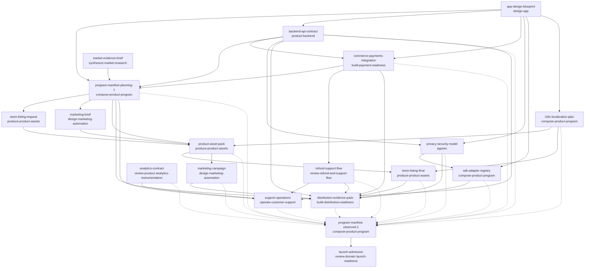

# Product Program Manifest — mobile-app

```text
program_id: mobile-app-delivery-program
product_id: mobile-app
manifest phase: planning (revision planning-1)
supersedes: none (root planning revision)
```

This planning revision directs work. It composes independently owned specialist artifacts; it does not own their live facts. The observed-state revision (`observed-1`) will supersede this revision and index exact accepted sibling evidence — it will not be consumed by any specialist named here.

---

## 0. Artifact envelope (planning revision `planning-1`)

```json
{
  "$schema": "https://github.com/SylphxAI/skills/blob/main/schemas/product-artifact-envelope.schema.json",
  "schemaVersion": 2,
  "artifactId": "program-manifest",
  "productId": "mobile-app",
  "artifactKind": "product-program-manifest",
  "ownerSkill": "compose-product-program",
  "artifactVersion": "1.0.0",
  "artifactRevision": "planning-1",
  "artifactState": "draft",
  "inputArtifacts": [
    {
      "artifactId": "app-design-blueprint",
      "artifactVersion": "requested",
      "artifactRevision": "requested",
      "artifactState": "draft",
      "relation": "upstream-design-input",
      "fulfillsHandoffId": "ho.design.capabilities"
    },
    {
      "artifactId": "market-evidence-brief",
      "artifactVersion": "requested",
      "artifactRevision": "requested",
      "artifactState": "draft",
      "relation": "market-evidence-input",
      "fulfillsHandoffId": "ho.market.evidence"
    },
    {
      "artifactId": "backend-api-contract",
      "artifactVersion": "requested",
      "artifactRevision": "requested",
      "artifactState": "draft",
      "relation": "backend-contract-input",
      "fulfillsHandoffId": "ho.backend.contract"
    },
    {
      "artifactId": "commerce-payments-integration",
      "artifactVersion": "requested",
      "artifactRevision": "requested",
      "artifactState": "draft",
      "relation": "payments-integration-input",
      "fulfillsHandoffId": "ho.payments.integration"
    }
  ],
  "canonicalFactsOwned": [
    "cross-domain dependency graph and delivery order",
    "artifact and owner registry with one owner per fact",
    "stable producer-owned handoff IDs and handoff acceptance tests",
    "collision boundaries and their owning checks",
    "release targets and channel capability matrix",
    "program Definition of Done and ruin boundaries",
    "SDK provider/version/disclosure/replacement registry",
    "cross-channel i18n coverage and acceptance graph",
    "typed blocker register and next machine actions",
    "observed-state revision indexing protocol"
  ],
  "handoffOutputs": [
    {
      "handoffId": "ho.plan.release-targets",
      "consumerSkill": "produce-product-assets",
      "artifactKind": "product-program-manifest",
      "contract": "Release targets, channel matrix, Definition of Done, stable handoff IDs and collision boundaries for planning revision planning-1.",
      "acceptanceTests": [
        {
          "testId": "h1",
          "assertion": "Consumer references planning-1 by exact artifactId/version/revision/state and never by a moving alias such as 'latest manifest'."
        },
        {
          "testId": "h2",
          "assertion": "Every declared channel, locale, release target and handoff ID in the consumer artifact exists in planning-1's registry."
        }
      ]
    },
    {
      "handoffId": "ho.plan.sdk-registry",
      "consumerSkill": "build-distribution-readiness",
      "artifactKind": "sdk-adapter-registry",
      "contract": "Vendor-neutral SDK port registry with provider, version, license, SBOM, disclosure, consent/dormant controls, replacement test and kill switch per adapter.",
      "acceptanceTests": [
        {
          "testId": "h1",
          "assertion": "Every SDK entry records provider, exact version, license, SBOM, disclosure, dormant-state proof, replacement test and kill switch."
        },
        {
          "testId": "h2",
          "assertion": "Store privacy and data-safety disclosures are freshness-gated to this registry and to the runtime SDK/data manifest."
        }
      ]
    },
    {
      "handoffId": "ho.plan.i18n-coverage",
      "consumerSkill": "produce-product-assets",
      "artifactKind": "localization-plan",
      "contract": "Declared locale set, explicit fallback graph, LQA coverage, media/string/legal/support coverage and acceptance graph for localization.",
      "acceptanceTests": [
        {
          "testId": "h1",
          "assertion": "Every declared locale has LQA acceptance evidence or an exact typed blocker; none is covered by ad-hoc English fallback."
        },
        {
          "testId": "h2",
          "assertion": "Localized product, payments, safety, support, store metadata, screenshots, trailers, captions, alt text and release notes are all in the coverage graph."
        }
      ]
    }
  ],
  "assumptions": [
    {
      "assumptionId": "ASM-1",
      "statement": "Product semantics will permit a first-class HTML5/PWA route in addition to iOS and Android; otherwise a semantic or hard-floor reason must be recorded.",
      "status": "unverified"
    },
    {
      "assumptionId": "ASM-2",
      "statement": "Payment provider selection and merchant authority are not yet decided; integration is owned by build-payment-readiness and stays provider-neutral at the ledger boundary.",
      "status": "unverified"
    },
    {
      "assumptionId": "ASM-3",
      "statement": "Locale and territory set is not yet decided; it must trace to market evidence, not to a translated-marketing shortcut.",
      "status": "unverified"
    },
    {
      "assumptionId": "ASM-4",
      "statement": "Apple Developer and Google Play accounts, agreements, and signing identities will exist before the distribution slice; automation prepares and polls but cannot approve them.",
      "status": "unverified"
    },
    {
      "assumptionId": "ASM-5",
      "statement": "One product repository owns backend and app source truth, and the active delivery profile retains mutation authority for source, build, and runtime.",
      "status": "unverified"
    },
    {
      "assumptionId": "ASM-6",
      "statement": "Desktop and console channels are not selected for v1; no certification or availability claim will be made for them, and adapters stay architecture-ready only where the design requires.",
      "status": "unverified"
    }
  ],
  "proofState": "design-validated",
  "proofEvidence": [
    {
      "evidenceId": "EV-P1",
      "evidenceType": "design-study",
      "candidateId": "program-manifest-planning-1",
      "environment": "workspace:/tmp/sylphx-qualify-compose-product-program-run-2026-08-11T07-12-56-899Z-agent-follows-procedure",
      "evidenceRef": "program-manifest.md#dependency-dag",
      "observedAt": "2026-08-11T07:12:56Z",
      "liveReadback": false
    },
    {
      "evidenceId": "EV-P2",
      "evidenceType": "design-study",
      "candidateId": "program-manifest-planning-1",
      "environment": "workspace:/tmp/sylphx-qualify-compose-product-program-run-2026-08-11T07-12-56-899Z-agent-follows-procedure",
      "evidenceRef": "program-manifest.md#artifact-and-owner-registry",
      "observedAt": "2026-08-11T07:12:56Z",
      "liveReadback": false
    }
  ],
  "supersedes": []
}
```

The top-level envelope carries `artifactVersion`, `artifactRevision`, `artifactState` and never `artifactDigest`. Every input reference above carries `fulfillsHandoffId`; all four inputs are drafts, so no digest is invented. When a downstream consumer seals this planning revision, it records the sha-256 digest with `digestRule: sha256-exact-bytes` in its own envelope — this manifest never self-hashes.

---

## 1. Objective, constraints, ruin boundaries, Definition of Done

### 1.1 Objective

Deliver a new mobile app (`mobile-app`) to generally-available release across iOS and Android, with HTML5/PWA as a first-class route when design semantics permit, composing seven lifecycle domains — design, backend API, commerce/payments, assets, release, marketing, and support — through one immutable planning revision, exact typed handoffs, and a later observed-state revision that indexes accepted evidence. Every selected capability is built to its complete declared correctness and lifecycle floor through small verified slices; external authority gates are prepared and polled by automation but never fabricated.

### 1.2 Program truth (current state)

| Fact | Status | Owner |
| --- | --- | --- |
| Product type | given — new mobile app | this manifest |
| App/game design artifact | missing — typed request emitted (`app-design-blueprint`) | `design-app` |
| Primary user promise | not invented — requested from `design-app` | `app-design-blueprint` |
| Business model / monetization | not invented — requested from `design-app` | `app-design-blueprint` |
| Target platforms | given — iOS, Android; HTML5/PWA pending semantics (ASM-1) | this manifest / design |
| Locales/territories | pending market evidence (ASM-3) | `market-evidence-brief` |
| Audience/age modes | requested from `design-app` | `app-design-blueprint` |
| Data sensitivity | requested from `design-app`; actual data map from backend | `app-design-blueprint` / `backend-api-contract` |
| Delivery target | declared — GA `1.0.0` on App Store and Google Play; HTML5/PWA per design decision | this manifest |

### 1.3 Constraints

- C-1 — No P0/P1/P2, MVP, or historical-effort deferral. Capabilities advance on independent state axes only: Construction (`build-to-scale-now | queued-by-exact-dependency | floor-blocked | retired`), Proof (`hypothesis | design-validated | implementation-verified | scale-verified | production-proven`), Exposure (`unavailable | authority-gated | canary | staged | generally-available | degraded | withdrawn`).
- C-2 — One canonical owner per fact. This manifest owns the graph, release targets, handoffs, DoD, collision boundaries, SDK registry, i18n coverage graph, blockers and evidence ledger — never the app UX, prices, transactions, refund consequences, campaign semantics, localized strings, finished media, listing, or distribution evidence.
- C-3 — Envelope vocabulary is exact: top-level `artifactVersion`/`artifactRevision`/`artifactState`, never a top-level digest; every input reference carries `fulfillsHandoffId`; sealed inputs additionally carry `artifactDigest: sha256:...` and `digestRule: sha256-exact-bytes`; drafts carry no digest. No invented fields.
- C-4 — Planning revision `planning-1` is immutable once consumed. No revision both consumes and indexes the same artifact. No consumer resolves a moving alias such as "latest manifest".
- C-5 — Build once, attest, sign, and promote the exact artifact. Raw signing keys never enter agent context (secrets broker / HSM / protected CI identity / platform service).
- C-6 — Live platform/API/asset/policy facts are volatile. They are retrieved from official authority at execution with URL, publisher, scope, effective/retrieval/expiry times and digest. No API version, quota, SLA, asset dimension, locale list, fee, or certification rule is hardcoded in this manifest.
- C-7 — Privacy/consent floor: disabled SDKs mean no initialization, permission, data collection, network, background job, public surface, or runtime reservation; consent withdrawal propagates to collection, storage, sharing, deletion and future initialization; SDK failure never blocks core startup without a declared correctness/security dependency.
- C-8 — External review, partner access, certification, contracts, signing authority, law, safety, consent and physical constraints remain real gates. Automation prepares, submits, polls, reconciles, recovers and records evidence; it never fabricates authority or approval.
- C-9 — Done means delivered at the active repository delivery boundary with acceptance evidence and live readback. Local diff, PR, merge, upload, approval, staged release and production behavior are distinct states.
- C-10 — Rollback may not erase committed ledger facts, grants, user work, or cross-device consistency. Plan rollout halt, remote degradation, server compatibility, safe migration, and a forward superseding build.

### 1.4 Ruin boundaries (kill/redesign conditions)

- RB-1 — Any dependency cycle in the artifact graph, or any revision that both consumes and indexes the same artifact: freeze the graph, redesign the manifest, re-seal.
- RB-2 — Marketing or listing claims exceed design-validated capability or platform availability: halt that campaign/listing until the claim is corrected or capability is proven.
- RB-3 — Price/catalog/entitlement/refund divergence across UI, provider, ledger, support and campaign with no root-cause correction path: halt commerce promotion and promotion of the build.
- RB-4 — Privacy/consent violation, or store data-safety disclosure diverging from runtime SDK behavior: halt release, fix disclosure or runtime, re-attest.
- RB-5 — Releasing an artifact whose digest differs from the tested/attested candidate, or no live store/runtime readback after GA: treat as failed proof, not completion.
- RB-6 — Fabricated external authority (certification, approval, review receipt, live state): immediate program halt, retraction, and root-cause repair.
- RB-7 — Data-loss risk from migration/rollback (offline work, committed purchases, grants, cross-device state): no rollout step proceeds without a verified recovery path.
- RB-8 — Any capability below its declared floor defended by "later", "too expensive", "no users", or "uncertain ROI": escalate as a typed blocker, never silently shrink the objective.

### 1.5 Definition of Done

The program is done only when all of the following hold with evidence, never from a local diff or store submission alone:

- DoD-1 — `planning-1` is sealed, the graph is acyclic, every declared capability has one owner and a full target, and every handoff is executable.
- DoD-2 — `app-design-blueprint` is accepted at `design-validated` with capability semantics, monetization model, SDK semantic ports, data sensitivity, and localized product meaning.
- DoD-3 — `backend-api-contract` is `implementation-verified` (contract tests for auth, data path, error semantics) and `scale-verified` for its declared envelope (load and soak).
- DoD-4 — `commerce-payments-integration` is `implementation-verified` with a single entitlement/ledger source, sandbox purchase/restore probes passing, and scale-load evidence on the payment path.
- DoD-5 — `privacy-security-model`, `analytics-contract`, and `sdk-adapter-registry` are accepted; store disclosures derive from the runtime SDK/data manifest and are freshness-gated.
- DoD-6 — Every declared locale in the i18n coverage graph has LQA acceptance evidence; the fallback graph is explicit.
- DoD-7 — `product-asset-pack` is sealed with exact-file digests and rights/provenance QA passed; it covers all selected channels and locales.
- DoD-8 — `store-listing-final` and `marketing-campaign` are accepted with all collision tests green.
- DoD-9 — `distribution-evidence-pack` proves: exact artifact attested/signed, submitted, staged, promoted, and live store readback of version/build plus purchase/restore probes.
- DoD-10 — `support-operations` is running with an incident-recovery drill passed and a closed feedback loop.
- DoD-11 — Observed-state manifest `observed-1` supersedes `planning-1`, indexes the exact accepted sibling evidence (identity + digest + handoff + proof), and independent `launch-admission` is issued.
- DoD-12 — Each proof claim is per-layer (source / CI / artifact / store / live) and timestamped; no layer's evidence substitutes for another.

---

## 2. Artifact and owner registry (one owner per fact)

### 2.1 Canonical fact -> owner map

| Fact | Owner |
| --- | --- |
| Product promise, UX, capability semantics, localized product meaning | `app-design-blueprint` (design-app) |
| Monetization model and value-exchange semantics | `app-design-blueprint` (design-app) |
| SDK semantic ports and product behavior | `app-design-blueprint` (design-app) |
| Market/category/audience/claims/price/platform evidence | `market-evidence-brief` (synthesize-market-research) |
| API schema, identity/data authority, sync/offline/export/delete, residency | `backend-api-contract` (product-backend) |
| Actual data flows and runtime data map | `backend-api-contract` (product-backend) |
| Provider transaction, ledger, settlement, entitlement semantics | `commerce-payments-integration` (build-payment-readiness) |
| Refund customer/account consequence and appeal | `refund-support-flow` (review-refund-and-support-flow) |
| Consent model, privacy map, security floor | `privacy-security-model` (appsec) |
| Analytics event/identity contract | `analytics-contract` (review-product-analytics-instrumentation) |
| SDK provider/version/disclosure/replacement registry | `sdk-adapter-registry` (compose-product-program) |
| Cross-channel i18n coverage and acceptance graph | `i18n-localization-plan` (compose-product-program) |
| Campaign briefs/concepts, channel/budget/creative control plane | `marketing-brief`, `marketing-campaign` (design-marketing-automation) |
| Listing narrative, asset selection, channel metadata | `store-listing-request`, `store-listing-final` (produce-product-assets) |
| Exact rendered media, rights/provenance, file QA | `product-asset-pack` (produce-product-assets) |
| Channel eligibility, submission/certification/release evidence | `distribution-evidence-pack` (build-distribution-readiness) |
| Private feedback, review ingestion, routing, close-loop | `support-operations` (operate-customer-support) |
| Cross-domain DAG, release targets, handoffs, DoD | `program-manifest` (compose-product-program) |
| Independent launch evaluation | `launch-admission` (review-domain / launch-readiness) |
| Actual source/build/release/runtime truth | owning repo, build, store/partner, and runtime systems; indexed by `observed-1` |

### 2.2 Artifact registry

| ID | Kind | Owner skill/system | Version / Revision / State | Canonical facts |
| --- | --- | --- | --- | --- |
| `app-design-blueprint` | app-design-blueprint | `design-app` | requested / requested / draft | promise, UX, capabilities, monetization, SDK ports, data sensitivity, localized meaning, age/audience modes |
| `market-evidence-brief` | market-evidence-brief | `synthesize-market-research` | requested / requested / draft | category, audience, claims, price, platform and locale evidence |
| `backend-api-contract` | backend-api-contract | `product-backend` | requested / requested / draft | API schema, auth/identity, data authority, sync/offline/export/delete, residency, scale envelope |
| `commerce-payments-integration` | payments-integration | `build-payment-readiness` | requested / requested / draft | provider, ledger, settlement, entitlement, refund/chargeback hooks, idempotency |
| `refund-support-flow` | refund-support-flow | `review-refund-and-support-flow` | requested / requested / draft | refund consequence, appeal, data/entitlement effects |
| `privacy-security-model` | privacy-security-model | `appsec` | requested / requested / draft | consent model, privacy map, deletion propagation, security floor, store disclosure source |
| `analytics-contract` | analytics-contract | `review-product-analytics-instrumentation` | requested / requested / draft | event/identity schema, PII boundaries, dormant behavior |
| `sdk-adapter-registry` | sdk-adapter-registry | `compose-product-program` (this manifest) | 1.0.0 / planning-1 / draft | port->provider->version->disclosure->replacement registry |
| `i18n-localization-plan` | localization-plan | `compose-product-program` (this manifest) | 1.0.0 / planning-1 / draft | locale set, fallback graph, LQA coverage, asset coverage graph |
| `store-listing-request` | store-listing | `produce-product-assets` | requested / requested / draft | narrative, metadata and asset request per channel |
| `marketing-brief` | marketing-brief | `design-marketing-automation` | requested / requested / draft | campaign concepts, claims, audience/consent, asset requests |
| `product-asset-pack` | product-asset-production-pack | `produce-product-assets` | requested / requested / draft | exact screenshots, key art, trailers, captions, alt text, release notes, localized variants, rights/provenance, file QA |
| `store-listing-final` | store-listing | `produce-product-assets` | requested / requested / draft | final channel listing consuming the exact pack |
| `marketing-campaign` | marketing-campaign | `design-marketing-automation` | requested / requested / draft | campaign candidate, deep links, spend, measurement, consent |
| `distribution-evidence-pack` | distribution-evidence-pack | `build-distribution-readiness` | requested / requested / draft | eligibility, exact artifact, signing/attestation, submission, certification, rollout, readback |
| `support-operations` | support-operations | `operate-customer-support` | requested / requested / draft | feedback ingestion, routing, incident recovery, close-loop |
| `program-manifest` (this file) | product-program-manifest | `compose-product-program` | 1.0.0 / planning-1 / draft | DAG, handoffs, targets, DoD, collision boundaries, blockers, evidence ledger |
| `program-manifest-observed` | product-program-manifest | `compose-product-program` | 1.0.0 / observed-1 / sealed (future) | index of accepted sibling evidence; supersedes planning-1 |
| `launch-admission` | launch-admission | `review-domain` (launch-readiness) | requested / requested / draft | independent go/no-go evaluation |

Inputs/outputs per artifact are the handoff rows in section 4; proof targets and supersession are in section 11. A registry row never copies a sibling fact; it references the owner.

---

## 3. Lifecycle capability matrix

State axes: Construction (`build-to-scale-now | queued-by-exact-dependency | floor-blocked | retired`), Proof (`hypothesis | design-validated | implementation-verified | scale-verified | production-proven`), Exposure (`unavailable | authority-gated | canary | staged | generally-available | degraded | withdrawn`).

| Capability | Owner artifact | Construction | Proof | Exposure | Scale envelope | Migration / recovery |
| --- | --- | --- | --- | --- | --- | --- |
| Product experience | `app-design-blueprint` | queued-by-exact-dependency (typed request emitted) | hypothesis | unavailable | declared by design (audience/age modes, platforms) | design supersession rule; no promotion without accepted revision |
| Backend API + data path | `backend-api-contract` | queued-by-exact-dependency (design capabilities) | hypothesis | unavailable | declared envelope in contract; load+soak before GA | schema versioning, N-1/N/N+1 compat, data migration plan, kill switch |
| Commerce/payments | `commerce-payments-integration` | queued-by-exact-dependency (design monetization + backend identity) | hypothesis | unavailable | provider quotas live-retrieved; ledger idempotent at scale | provider replacement test; ledger never rewritten on rollback |
| Refund + support consequence | `refund-support-flow` | queued-by-exact-dependency (payments integration) | hypothesis | unavailable | refund volume envelope from provider + ledger | refund never destroys data/entitlements; appeal path |
| Privacy/security | `privacy-security-model` | queued-by-exact-dependency (data sensitivity + backend data map) | hypothesis | unavailable | disclosure freshness gate per store | consent withdrawal propagation, deletion/export, incident response |
| Analytics | `analytics-contract` | queued-by-exact-dependency (design + backend) | hypothesis | unavailable | event volume envelope; dormant when disabled | schema versioning, PII boundary migration |
| SDK adapters | `sdk-adapter-registry` | build-to-scale-now (registry contract emitted) | design-validated (registry structure) | unavailable | startup budget proof per SDK; zero-cost dormant | replacement tests, kill switches, disclosure sync loop |
| Globalization | `i18n-localization-plan` | build-to-scale-now (coverage graph emitted) | design-validated (coverage graph) | unavailable | per-locale LQA evidence; fallback graph | locale addition loop; cultural/legal residual-risk states |
| Assets | `product-asset-pack` | queued-by-exact-dependency (briefs + listing request + plan) | hypothesis | unavailable | all selected channels/locales; sealed digests | rights/provenance re-check on reuse; superseding pack revisions |
| Store listing | `store-listing-final` | queued-by-exact-dependency (pack + plan) | hypothesis | unavailable | per-channel metadata/asset coverage | metadata refresh loop; claim re-validation on capability change |
| Marketing | `marketing-campaign` | queued-by-exact-dependency (brief + pack) | hypothesis | unavailable | spend/measurement evidence per campaign | campaign refresh loop; claim re-validation |
| Distribution/release | `distribution-evidence-pack` | queued-by-exact-dependency (plan + upstream set) | hypothesis | unavailable -> authority-gated -> canary -> staged -> GA | rollout cohorts; health gates; halt/withdraw | forward superseding build; store rollback not assumed |
| Support/operations | `support-operations` | queued-by-exact-dependency (plan + refund + backend) | hypothesis | unavailable | incident runbook drill; feedback loop | incident recovery, review ingestion, close-loop |
| Program graph | `program-manifest` | build-to-scale-now | design-validated (this revision) | unavailable (directs work, not exposed) | acyclic graph; one owner per fact | superseded by `observed-1`; immutable once consumed |

---

## 4. Dependency DAG, critical path, delivery order, collision boundaries, handoff acceptance

### 4.1 Dependency DAG (acyclic)

Solid edges are typed consumption handoffs; dashed edges are index-only references from the observed-state revision (indexing is not consumption).



### 4.2 Topological delivery order and critical path

```text
[S1 design] -> [S2 backend] -> [S3 payments] -> [S4 privacy/analytics/SDK, S5 i18n] 
-> [S6 assets] -> [S7 listing + marketing] -> [S8 distribution] -> [S10 observed + admission]
```

Critical path: `app-design-blueprint -> planning-1 -> backend-api-contract -> commerce-payments-integration -> refund-support-flow -> distribution-evidence-pack -> observed-1 -> launch-admission`, with store review/certification as the dominant external-authority long pole. Asset/listing/marketing and privacy/SDK/i18n branches run in parallel off the same planning revision.

### 4.3 Shared-state and external-authority boundaries

| Shared state | Single owner | Cross-domain consumers |
| --- | --- | --- |
| Price/catalog | `commerce-payments-integration` (ledger + provider) | UI, entitlement, support, campaign, store listing |
| Entitlement | `commerce-payments-integration` | backend, support, campaign deep links, rollout |
| SDK/data manifest + disclosures | `sdk-adapter-registry` + `privacy-security-model` | store data-safety, consent, runtime |
| Localized metadata | `store-listing-final` / `product-asset-pack` | distribution, support, campaigns |
| Artifact identity (digest) | owning build + `distribution-evidence-pack` | all release gates, observed-1 |
| Release targets/handoffs | `program-manifest` planning-1 | all specialist consumers |

External-authority gates (automation prepares/polls/records; cannot approve): Apple Developer account and agreement; Google Play developer account and agreement; signing identities/HSM; payment provider merchant approval; store review/certification per channel; legal/age-rating where required; any partner channel agreement.

### 4.4 Collision boundaries

| ID | Boundary | Owning check | Gate |
| --- | --- | --- | --- |
| CB-1 | App claims vs marketing creative vs store listing | claims trace to `app-design-blueprint` capabilities | before S7 acceptance and every campaign/listing revision |
| CB-2 | Price/catalog across UI, provider, entitlement, support, campaign | single source = payments integration | before S7 and at every release gate |
| CB-3 | Refund consequence vs data/export promise | `refund-support-flow` vs design data contract | before S8 |
| CB-4 | Locale, age, privacy, commerce consistency across channels | `i18n-localization-plan` + `privacy-security-model` | before S7/S8 |
| CB-5 | SDK runtime behavior vs consent/store disclosure | runtime manifest vs `sdk-adapter-registry` | at every build and store submission |
| CB-6 | Tested artifact vs released artifact | digest equality (sha256-exact-bytes) | at promote/halt |
| CB-7 | Min-version update gate vs offline/old-device users | backend contract + rollout policy | before staged expansion |
| CB-8 | Campaign deep links vs availability/entitlement/region | `marketing-campaign` vs release state | before campaign go-live |
| CB-9 | Rollback vs committed ledger/grants/user work | payments + backend migration plan | before any rollout step |
| CB-10 | Manifest revision cycle (consume+index same artifact) | graph acyclicity check per revision | at every revision seal |

### 4.5 Handoff registry (typed handoffs and acceptance tests)

| handoffId | Producer | Consumers | artifactKind | Contract | Acceptance tests |
| --- | --- | --- | --- | --- | --- |
| `ho.design.capabilities` | design-app | program-manifest, backend, payments | app-design-blueprint | Product promise, UX, capability semantics, ruin boundaries, audience/age modes, platform surfaces. | h1: every promise has an owning capability + proof state; h2: no capability referenced downstream lacks a blueprint owner |
| `ho.design.monetization` | design-app | build-payment-readiness | app-design-blueprint | Value-exchange and monetization model; paid/priced/subscribed/granted units. | h1: sellable units and price authority named; h2: commerce UI and provider catalog derive from it, no parallel SSOT |
| `ho.design.sdk-ports` | design-app | compose-product-program | app-design-blueprint | Semantic SDK ports with interface, data, consent, startup budget, degraded behavior. | h1: every required port declared semantically; h2: no provider name is a port contract |
| `ho.design.data-sensitivity` | design-app | appsec | app-design-blueprint | Data classes, purpose, retention, deletion/export, residency, age/territory constraints. | h1: data classes map to purpose/retention/deletion; h2: age/territory constraints machine-checkable |
| `ho.design.localized-meaning` | design-app | compose-product-program | app-design-blueprint | Localized semantics; terminology; cultural/legal-sensitive topics. | h1: sensitive items enumerated with context; h2: fallback + terminology authority per locale |
| `ho.market.evidence` | synthesize-market-research | program-manifest | market-evidence-brief | Category, audience, claims, price, platform/locale evidence with retrieval metadata. | h1: platform/locale selection traces to cited evidence; h2: unsupported claims stay labeled hypothesis |
| `ho.backend.contract` | product-backend | program-manifest, payments, privacy, distribution, support | backend-api-contract | API schema, auth/identity, data authority, offline/sync/export/delete, residency, error/rate contract, scale envelope. | h1: contract tests pass for auth/data/error paths; h2: scale-load + scale-soak evidence for declared envelope before GA |
| `ho.backend.data-map` | product-backend | appsec | backend-api-contract | Actual data flows, endpoints, retention, deletion/export implementation. | h1: data-map matches design data-sensitivity; h2: store disclosures derive from this map |
| `ho.payments.integration` | build-payment-readiness | program-manifest, refund-flow, distribution | payments-integration | Provider transaction, ledger, settlement, entitlement, idempotency, refund/chargeback hooks. | h1: every transaction has an idempotency key; sandbox purchase/restore probes pass; h2: single entitlement source, no second writer |
| `ho.refund.policy` | review-refund-and-support-flow | support, distribution | refund-support-flow | Refund consequence, appeal, data/entitlement effects. | h1: refund never destroys design-promised data; h2: consequence consistent across provider/UI/support |
| `ho.privacy.model` | appsec | sdk-registry, distribution | privacy-security-model | Consent model, privacy map, deletion propagation, security floor, disclosure source. | h1: disabled SDK shows zero init/permission/network/background proof; h2: consent withdrawal propagates fully |
| `ho.analytics.contract` | review-product-analytics-instrumentation | support, observed-1 | analytics-contract | Versioned event/identity contract; PII boundaries; dormant behavior. | h1: event schema versioned with PII enforcement; h2: no vendor SDK is the canonical event model |
| `ho.plan.release-targets` | compose-product-program | marketing, listing, assets, distribution, support | product-program-manifest | Release targets, DoD, channel matrix, handoff IDs, collision boundaries of planning-1. | h1: consumers reference planning-1 exactly, never "latest"; h2: all referenced targets/IDs exist in planning-1 |
| `ho.plan.sdk-registry` | compose-product-program | distribution | sdk-adapter-registry | Port->provider/version/disclosure/replacement registry with dormant/consent controls. | h1: every SDK row complete (see 2.1); h2: store disclosures freshness-gated to registry |
| `ho.plan.i18n-coverage` | compose-product-program | assets, listing-final | localization-plan | Locale set, fallback graph, LQA coverage, coverage of product/payments/safety/support/store/media strings. | h1: each declared locale has LQA evidence or typed blocker; h2: fallback graph explicit, never ad-hoc English |
| `ho.marketing.brief` | design-marketing-automation | produce-product-assets | marketing-brief | Campaign concepts, creative brief, claims, audience/consent, channel/budget control plane. | h1: every claim traces to design-validated capability; h2: exact asset requests with formats + rights |
| `ho.listing.request` | produce-product-assets (store-listing) | produce-product-assets (assets) | store-listing | Listing narrative, metadata, asset request, selection/order, channel coverage. | h1: request references planning-1 handoff IDs; h2: asset list covers all declared channels/locales |
| `ho.assets.pack` | produce-product-assets | listing-final, campaign, distribution | product-asset-production-pack | Exact rendered media + localized variants; rights/provenance; file QA. | h1: pack sealed with per-file digests + provenance; h2: all brief/request items covered with QA evidence |
| `ho.listing.final` | produce-product-assets (store-listing) | distribution | store-listing | Final channel listing consuming the exact pack revision. | h1: listing claims pass CB-1/CB-2/CB-4; h2: references exact pack revision + digests |
| `ho.marketing.campaign` | design-marketing-automation | distribution, observed-1 | marketing-campaign | Campaign candidate with deep links, spend, measurement, consent, moderation. | h1: deep links resolve to available/entitled/region-valid states (CB-8); h2: spend + measurement evidence recorded |
| `ho.distribution.evidence-pack` | build-distribution-readiness | observed-1 | distribution-evidence-pack | Eligibility, exact artifact, signing/attestation, submission, certification state, rollout, live readback. | h1: store readback matches tested digest (CB-6); h2: rollout health gates recorded with decisions |
| `ho.support.operations` | operate-customer-support | observed-1 | support-operations | Feedback ingestion, review routing, incident recovery, close-loop. | h1: incident runbook drill passes with observed evidence; h2: feedback routes product action with close-loop records |
| `ho.observed-state` | compose-product-program | launch-admission | product-program-manifest | observed-1 supersedes planning-1 and indexes exact accepted sibling evidence. | h1: every indexed artifact has exact identity + digest + handoffId + proof state; h2: no indexed evidence has observedAt after observed-1 identity |
| `ho.launch.admission` | review-domain (launch-readiness) | delivery owner (release authority) | launch-admission | Independent go/no-go evaluation of observed-1 evidence. | h1: admission records evidence reviewed + authority; h2: admission is not authored by the manifest author |

### 4.6 Validation gates

| Gate | Where | Criterion | Evidence |
| --- | --- | --- | --- |
| G-1 handoff acceptance | every handoff in 4.5 | producer contract + acceptance tests pass | testId + evidenceRef per acceptance test |
| G-2 artifact identity | every build/promote | tested digest == released digest (sha256-exact-bytes) | build receipt, attestation, store readback |
| G-3 release health | canary/staged/GA | crash/hang/startup/latency/error gates within declared envelope | telemetry + incident records |
| G-4 commerce | canary/staged/GA | purchase/restore/refund/entitlement probes pass | probe receipts + ledger reconciliation |
| G-5 support/safety | staged/GA | complaint/privacy/safety gates within declared threshold | support + moderation records |
| G-6 rollout | each step | cohort size, observation window, hysteresis, cooldown respected | rollout state machine log |
| G-7 store readback | after promote | live store shows exact version/build + territory/price/rollout state | official channel readback, timestamped |
| G-8 launch admission | terminal | independent go/no-go on observed-1 | `ho.launch.admission` envelope |

---

## 5. Platform/channel capability matrix and release-control state machines

| Channel | Product format | Selected | Transitions / gates | Evidence owner |
| --- | --- | --- | --- | --- |
| Apple App Store (+ TestFlight) | iOS | yes (GA target) | prepare -> validate -> build -> attest -> sign -> upload -> poll -> submit_review -> poll_review -> stage -> promote|halt -> live_readback; agreement + signing authority gate | `distribution-evidence-pack` |
| Google Play (internal/closed/open tracks) | Android | yes (GA target) | same state machine; per-track rollout cohorts; agreement + signing authority gate | `distribution-evidence-pack` |
| HTML5/PWA | web | conditional (ASM-1; first-class default when semantics permit) | deploy URL -> staged -> GA; manifest/service-worker/push per W3C routes, live-retrieved | `distribution-evidence-pack` |
| Huawei AppGallery / Samsung / Amazon | Android alt | not selected for v1; adapters architecture-ready only | no certification or availability claim; selection gated by `market-evidence-brief` | `distribution-evidence-pack` |
| Microsoft/desktop, Steam/Epic, consoles | various | not applicable for v1 (hard floor: no partner claim, no selected target) | no readiness claim; no authority fabrication | n/a |
| Owned web, YouTube, X | promotional surfaces | asset consumers, not binary stores | consume `product-asset-pack`/campaign outputs; API/moderation/synthetic-media rules live-retrieved | `design-marketing-automation` + `produce-product-assets` |

Release-control state machine (common adapter, per channel):

```text
prepare -> validate -> build -> attest -> sign -> notarize_or_certify_if_required
-> upload -> poll_processing -> submit_review -> poll_review
-> stage -> promote | halt
-> live_readback -> supersede | withdraw
```

Rules: build once and promote the exact artifact; portal-only/manual external gates are typed states with evidence, never invisible checklists; store rollback is not assumed — plan halt, remote degradation, server compatibility, forward superseding build; minimum-version and N-1/N/N+1 compatibility are part of rollout policy. Fees, review SLAs, quotas, and API versions are live-retrieved from official authority at execution, never frozen here.

---

## 6. i18n/culturalization plan and asset pack handoff

- Contract: stable message IDs with plural/select and grammatical variables; explicit fallback graph by language/script/region; Unicode/graphemes, fonts/glyphs, CJK, RTL/bidi, IME, sorting/search, text expansion; locale-aware date/time/calendar/number/currency/unit/address/name.
- Coverage: localized product, payments/refunds, safety, support, privacy/legal, notifications, store metadata, screenshots, trailers, captions, alt text, release notes, and marketing — not strings alone.
- QA: pseudolocalization, missing-string and forbidden-literal checks, RTL/overflow visual tests, OCR and accessibility; glossary/style/terminology memory; translation provenance, confidence, and target-user evidence. Agent translation scale is never treated as native-proof.
- Cultural/legal/claim/age-rating/sensitive-topic review is an explicit residual-risk state owned by the blueprint + `review-domain`.
- `produce-product-assets` pack inputs: source scenes and captures, device-class screenshots, key/capsule art, trailers, captions, alt text, release notes, store metadata variants, localized variants, rights/provenance records, and QA evidence. Pack consumes `ho.plan.release-targets`, `ho.plan.i18n-coverage`, the exact `ho.marketing.brief`, and `ho.listing.request`; only selected branches consume the pack; distribution owns upload/processing/submission/readback.
- Downstream handoffs: `ho.assets.pack` -> `ho.listing.final`, `ho.marketing.campaign`, `distribution-evidence-pack`. A changed downstream request creates a new brief or pack revision — never a same-revision back-reference.

---

## 7. Vendor-neutral SDK adapter registry

Ports (defined before providers): analytics, crash-diagnostics, consent, attribution, ads-mediation, commerce, auth-social, push, deep-links, remote-config, experimentation, AI-model, support, platform-services.

Each adapter row records: interface/schema version + conformance fixtures; provider, fallback and replacement path; package version, license, SBOM, provenance, update policy; data collected/shared, purpose, destination, retention, deletion; consent/age/territory/entitlement/device preconditions; lazy initialization, startup budget, zero-cost dormant proof; permissions/manifest declarations/endpoints/background work; offline/retry/idempotency/rate limits/dedupe; failure isolation, circuit breaker, kill switch, degradation; privacy/security/store evidence + current authority record.

Rules (binding):
- No vendor SDK becomes the canonical event, consent, entitlement, experiment, or user-state model.
- Disabled = no init, permission, data, network, background job, public surface, or reservation.
- Consent withdrawal propagates to collection, storage, sharing, deletion and future init.
- SDK failure cannot block core startup unless it is a declared correctness/security dependency.
- Replacement tests run against the port contract; provider-specific features stay isolated.
- Store privacy/data-safety disclosures derive from the same runtime SDK/data manifest and are freshness-gated (Apple/Google requirements live-retrieved for exact versions at release).

---

## 8. Exact-artifact build/sign/attest/submit/stage/promote/halt/readback graph and evidence pack

```text
source commit + reproducible build inputs
-> build -> SBOM/provenance/attestation -> sign (secrets broker/HSM/CI identity, never agent context)
-> notarize/certify if required -> upload -> poll_processing -> submit_review -> poll_review
-> stage -> promote | halt -> live_readback -> supersede | withdraw
```

Evidence pack fields (`distribution-evidence-pack`): planning manifest revision + handoff IDs; product/channel/release IDs; source commit and reproducible inputs; version/build and artifact digest; SBOM, provenance, attestation; signing identity reference + authority scope; platform capability/permission/SDK/privacy inventory; server/API/schema compatibility; localized metadata + asset manifest IDs; submission/reviewer/certification package; rollout policy + health gates; recovery, superseding build and live probes.

Hard rules: never rebuild a different artifact after testing; raw signing keys never exposed to agents; upload is not release proof; promote requires digest equality (G-2) and store readback (G-7); halt/withdraw are first-class transitions with evidence.

---

## 9. Automated operations and maintenance plan (operating loops)

| Loop | Owner | Trigger | Observed success/failure evidence | Safe fallback | Handoff |
| --- | --- | --- | --- | --- | --- |
| Platform-policy refresh | `build-distribution-readiness` | policy/API change signal or expiry timer | official source URL, version, digest, effective/retrieval times | adapter quarantine; keep last attested policy snapshot | release lane |
| SDK version/disclosure refresh | `sdk-adapter-registry` (manifest) + product repo | release cadence, CVE, store requirement | registry row update + conformance test | pin last attested version; kill switch | build lane |
| i18n/asset refresh | `produce-product-assets` | locale addition, copy/claim change, store requirement | new pack revision sealed with digests | last sealed pack remains published | listing + campaign + distribution |
| Store metadata refresh | `produce-product-assets` | capability/claim change, store policy | listing revision + store readback | halt promotion; revert metadata | distribution |
| Campaign refresh | `design-marketing-automation` | campaign end, spend cap, claim change | campaign revision + measurement | stop spend; withdraw creative | listing + distribution |
| Support loop | `operate-customer-support` | tickets, reviews, feedback events | closed-loop records, routing evidence | manual escalation path | product action backlog |
| Incident recovery | product runtime + `build-distribution-readiness` | alert on health/commerce/safety gates | incident record, halt/degrade evidence, postmortem | server kill switch, feature degradation, superseding build | release lane + support |
| Dependency refresh | product repo + release lane | release cadence, security advisory | verified dependency update + CI proof | pinned last verified set | build lane |
| Rollout control | `build-distribution-readiness` | rollout step, health/commerce/support gates | rollout log with promote/halt/withdraw decisions | halt + forward superseding build | release authority |

Every loop has an owner, trigger, observed evidence, safe fallback, and typed handoff to the project that owns implementation or runtime operation. Manual dashboards/review are not the normal path; automation prepares, polls, reconciles and recovers within declared authority.

---

## 10. Blocker register (typed, never vague "later")

| ID | Type | Blocker | Owner | Evidence | Next machine action |
| --- | --- | --- | --- | --- | --- |
| B-1 | exact-dependency | `app-design-blueprint` not authored; promise/monetization/SDK-ports/data-sensitivity facts missing | design-app | typed request emitted via `ho.design.capabilities` | open typed artifact request with handoff contract; queue S1 |
| B-2 | exact-dependency | `market-evidence-brief` missing; locales/territories and platform selection unproven | synthesize-market-research | ASM-3, `ho.market.evidence` | request evidence brief; keep platform selection hypothesis |
| B-3 | exact-dependency | backend contract not authored; no data/identity authority | product-backend | `ho.backend.contract` | request contract; queue S2 on design acceptance |
| B-4 | exact-dependency | payments integration not authored; provider/ledger/entitlement undecided | build-payment-readiness | ASM-2, `ho.payments.integration` | request integration; queue S3 on design + backend |
| B-5 | authority-floor | Apple/Google developer accounts, agreements, signing identities absent | distribution owner + user | ASM-4 | automate prep/submission; cannot approve; surface as authority-gated |
| B-6 | authority-floor | payment provider merchant approval absent | build-payment-readiness | provider portal state | prepare/poll/reconcile; no fabricated approval |
| B-7 | external-pending | store review/certification in flight | build-distribution-readiness | submission receipt + poll state | poll with resumable operations; record typed state |
| B-8 | failed-proof | any gate (G-1..G-8) fails | owning artifact owner | gate evidence | open corrective candidate; re-verify; never defer below floor |
| B-9 | external-pending | legal/age-rating certification where required | review-domain + legal owner | certification request state | prepare/poll/reconcile; no invented certification |

---

## 11. Delivered-state evidence ledger and next machine actions

| Artifact | Current proof | Target proof (DoD) | Next machine action |
| --- | --- | --- | --- |
| `program-manifest` (planning-1) | design-validated (EV-P1, EV-P2) | sealed; consumed by all downstream | seal on first downstream consumption; record digest at consumer |
| `app-design-blueprint` | not authored | design-validated | emit typed request (B-1) |
| `market-evidence-brief` | not authored | hypothesis -> supported claims | emit request (B-2) |
| `backend-api-contract` | not authored | implementation-verified + scale-verified | emit request (B-3) |
| `commerce-payments-integration` | not authored | implementation-verified + scale-load | emit request (B-4) |
| `refund-support-flow` | not authored | design-validated | queue on payments |
| `privacy-security-model` | not authored | design-validated + disclosure source | queue on design data-sensitivity + backend data-map |
| `analytics-contract` | not authored | implementation-verified | queue on design + backend |
| `sdk-adapter-registry` | design-validated (structure in this revision) | implementation-verified with dormant proof | fill rows from `ho.design.sdk-ports`; conformance tests |
| `i18n-localization-plan` | design-validated (coverage graph in this revision) | LQA-passed per declared locale | fill from market evidence + design localized meaning |
| `store-listing-request` | not authored | accepted request | emit after planning-1 seal |
| `marketing-brief` | not authored | accepted brief | emit after planning-1 seal |
| `product-asset-pack` | not authored | sealed with digests + provenance | queue on briefs + listing request + i18n |
| `store-listing-final` | not authored | accepted; collision tests green | queue on pack |
| `marketing-campaign` | not authored | accepted; CB-8 green | queue on pack |
| `distribution-evidence-pack` | not authored | release-receipt + live-readback | queue on upstream set |
| `support-operations` | not authored | runbook drill passed | queue on plan + refund + backend |
| `program-manifest-observed` | not authored | sealed; supersedes planning-1 | author after sibling acceptance (protocol in section 12) |
| `launch-admission` | not authored | independent go/no-go | consume `ho.observed-state` |

No row above claims implementation, release, or live proof that does not exist. A green manifest is not delivery.

---

## 12. Observed-state revision protocol (indexing without rewriting)

### 12.1 Purpose

`observed-1` (artifactId `program-manifest-observed`, artifactVersion `1.0.0`, artifactRevision `observed-1`, artifactState `sealed`) is authored only after every sibling artifact it indexes has been accepted. It supersedes `planning-1` and indexes the complete sibling set. Specialists never consume `observed-1`; `launch-admission` consumes `ho.observed-state` and nothing else.

### 12.2 Envelope rules for `observed-1`

- `supersedes`: exactly `[{ "artifactId": "program-manifest", "artifactVersion": "1.0.0", "artifactRevision": "planning-1", "artifactState": "sealed", "artifactDigest": "<computed-at-consumption>", "digestRule": "sha256-exact-bytes", "relation": "supersedes-planning-revision" }]` — no `fulfillsHandoffId` on a supersession ref.
- `inputArtifacts`: empty. The observed-state revision indexes; it never consumes the same artifact it indexes (same-revision consume+index is a hard violation).
- `canonicalFactsOwned`: the evidence index itself plus the same graph/DoD facts — never sibling facts.
- `proofState`: `production-proven` only when at least one `live-readback` evidence entry with `liveReadback: true` is present; otherwise the honest lower state.

### 12.3 Evidence index record (one row per accepted sibling)

```text
| indexed artifactId | artifactVersion | artifactRevision | artifactState | artifactDigest (sha256, only when sealed) | digestRule | fulfillsHandoffId | proofState | acceptance evidence refs | observedAt |
```

Rules:
1. Every indexed artifact is referenced by exact identity — no aliases, no "latest manifest".
2. A sealed sibling's row carries its digest recorded by `observed-1` (the digest lives in the index, never self-hashed by the sibling).
3. The row records `fulfillsHandoffId` so acceptance traces to the exact producer-owned handoff contract.
4. The row references the sibling's acceptance evidence (`evidenceRef`, `candidateId`, `environment`) without copying its facts.
5. Every indexed `observedAt` must predate `observed-1`'s own immutable identity; `observed-1` may not claim evidence produced after itself.
6. If a sibling is superseded by a new revision, `observed-1` is not mutated — a new observed-state revision (`observed-2`) supersedes it and indexes the new accepted set.
7. Sibling facts remain in their owners; the index stores identity + proof pointers only.
8. `launch-admission` consumes `observed-1`; the admission is authored by `review-domain`, never by the manifest author (no self-certification).

### 12.4 Example index rows (illustrative shape, digests are placeholders that must be computed at indexing time from exact sealed bytes)

```text
| app-design-blueprint | 0.1.0 | rev-3 | sealed | sha256:<compute-at-index> | sha256-exact-bytes | ho.design.capabilities | design-validated | evidence/blueprint-acceptance.json | 2026-08-11T00:00:00Z |
| backend-api-contract | 0.1.0 | rev-2 | sealed | sha256:<compute-at-index> | sha256-exact-bytes | ho.backend.contract | scale-verified | evidence/backend-scale.json | 2026-08-11T00:00:00Z |
| distribution-evidence-pack | 1.0.0 | ga-1 | sealed | sha256:<compute-at-index> | sha256-exact-bytes | ho.distribution.evidence-pack | production-proven | evidence/store-readback.json | 2026-08-11T00:00:00Z |
```

---

## 13. Completion check (planning revision)

- Every declared capability has one owner and a full declared target: satisfied in sections 2, 3, 5, 6, 7 (missing design facts are typed requests, not prose).
- Graph is acyclic: satisfied in section 4.1; no same-revision consume+index; no moving aliases.
- All handoffs and gates are executable: satisfied in sections 4.5, 4.6, 8, 9.
- Observed-state revision does not yet exist: by design, it must be authored only after sibling acceptance (section 12).
- This planning revision is a draft; it is sealed when the first downstream consumer references it with a recorded sha-256 digest. A manifest is not itself delivery.

## 14. Missing inputs (typed artifact requests)

| Requested artifact | Owner | Required handoff | Contract reference |
| --- | --- | --- | --- |
| `app-design-blueprint` | design-app | `ho.design.capabilities` (+ monetization, sdk-ports, data-sensitivity, localized-meaning) | section 4.5 |
| `market-evidence-brief` | synthesize-market-research | `ho.market.evidence` | section 4.5 |
| `backend-api-contract` | product-backend | `ho.backend.contract`, `ho.backend.data-map` | section 4.5 |
| `commerce-payments-integration` | build-payment-readiness | `ho.payments.integration` | section 4.5 |
| `refund-support-flow` | review-refund-and-support-flow | `ho.refund.policy` | section 4.5 |
| `privacy-security-model` | appsec | `ho.privacy.model` | section 4.5 |
| `analytics-contract` | review-product-analytics-instrumentation | `ho.analytics.contract` | section 4.5 |
| `support-operations` | operate-customer-support | `ho.support.operations` | section 4.5 |
| `launch-admission` | review-domain (launch-readiness) | `ho.launch.admission` (terminal, after observed-1) | section 12 |
